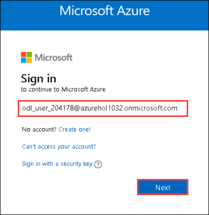
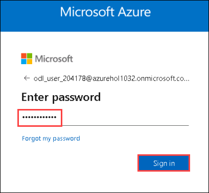
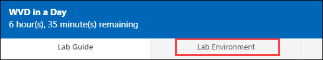
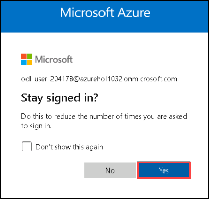
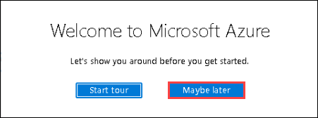
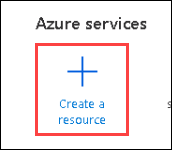
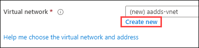
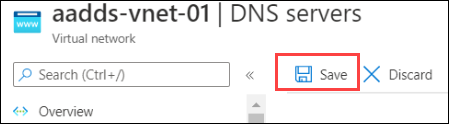

# Exercise 2: Azure AD Domain Services 

### **Task 1: Create prerequisites for AADDS**

1. Launch **Azure Portal** (https://portal.azure.com) in the desktop on left side. You can use the shortcut on the desktop. You'd be asked to choose default browser configurations, You can skip those for now by clicking cancel.

2. Login to Azure with the **username** **<inject key="AzureAdUserEmail" />**

   

3. Enter **password** **<inject key="AzureAdUserPassword" />** and click on **Sign in**.

   
   
> Refer the **Environment Details** tab for any other lab credentials/details.
  
  

4. There will be a pop-up entitled **Stay signed in?** with buttons for **No** and **Yes** - Choose **Yes**.

   

5. You may encounter a popup entitled **Welcome to Microsoft Azure** with buttons for **Start Tour** and **Maybe Later** - Choose **Maybe Later**.

   

6. In Azure Portal search for **Subscription** and click on **Subscriptions**.

   
   
7. Click on your subscription.

   
   
8. Under Settings blade Click on **Resource Providers**.

   
   
9. Now search for **Microsoft.AAD** and make sure Microsofr.ADD is **Registered**.

   
   
> In case the **Microsoft.AAD is not registred** then follow the **step 10** *.

10. Click on **Microsoft.AAD** Resource Provider and click on **Register**.

   

### **Task 2: Deploy AADDS**

1. On the Azure portal menu or from the Home page, select **Create a resource**.

   

2. Enter Domain Services into the search bar, then choose Azure AD Domain Services from the search suggestions.
   

3. On the Azure AD Domain Services page, click on **Create**.
   
    
4. Configure Basics blade with following settings.
      
   - **Subscription**: Select your subscription.
   - **Resource Group** : Select **WVD-RG**
   - **DNS domain name**: **Default value**
   - **Region**: select **East US**
   - **SKU**: **Standard**
   - **Forest type**: **User**

   
       
7. Then click **Next**.

8. In Networking tab under **Virtual network**, Click on **Create new**.
        
   

9. Configure your new virtual network with following settings and then click **Ok**.

   - **Name**: **aaddss-vnet-01**
   - **Address range**: **10.1.0.0/16**

Add following subnets:
   - **Subnet name**: **aadds-subnet**
   - **Address range**: **10.1.0.0/24**
   - **Subnet name**: **SessionHost-Subnet**
   - **Address range**: **10.1.1.0/24**

  

10. You will return to Networking tab, Here Select the following Subnet.
     
   - **Virtual network**: **(new)aadds-vnet-01** 
   - **Subnet**: **(new)aads-subnet-01 (10.0.0.0/24)**

   

Click on **Next**.

11. Click on **Review + Create** button.

    

12. Now click on **Create** Button.

    
    
13. A popup will appear, Click on **OK**.

    
    
    Wait for the Deployment to complete, It will take approx 30 minutes to deploy.


## Task 3: Update Virtual Network DNS

1. After deployment completes, go back to Azure portal home, and search for resource group and click on **Resource Groups**.
    
   
    
2. Now click on your **WVD-RG** resource group.

   
    
3. Click on **first NIC card**.

   
    
4. Note down the **Private IP** of first NIC card.

    
    
5. Now go back to your **WVD-RG** resource group and click on **second NIC card**.

    
    
6. Note down the **Private IP** of the second NIC card.

    
    
7. Go back to the **WVD-RG** resource group, and click on **aadds-vnet-01**.

    
    
8. Now under settings bade click on **DNS servers**.

    
    
9. Under DNS server select **custom** and add the IP address of first and second NIC card noted in step 19 and 21.
    
    
     
10. click on **Save**.
     
    

## Task 4: Create new AD users

1. In you Azure portal search bar, search for **Azure Active Directory** and click on it.

   

2. In Azure active directory page, left side under Manage blade click on **Users**.

   
   
3. Click on **+ new user**.

   
     
4. Under identity section enter following configuration.
   
      
 
   - **Username**: **WVDUser-01**
   
   - **Name**: **WVDUser-01**
   
5. Under pasword section use following configuration.

   - **Password**: Select **Let me create the password**
   
   - **Initial Passowrd**: **Azure1234567**
   
   

6. Leave remaining values at default and click on **Create**.
      
7. To create another user click on **+ New user**.

   

8. Under identity section enter following configuration.

   - **Username**: **WVDUser-02**
   - **Name**: **WVDUser-02**
   
       
   
9. Under pasword section use following configuration.
   
   **Password**: Select **Let me create the password**
   
   **Initial Passowrd**: **Azure1234567**
   
10. Leave remaining values at default and click on **Create**.
   
      
   
11. To create another user click on **+ New user**.

     

12. Under identity section enter following configuration.
      
   - **Username**: **DomainJoinAdminUser**
   
   - **Name**: **DomainJoinAdminUser**

      
   
13. Under pasword section use following configuration.
   
   - **Password**: Select **Let me create the password**
   
   - **Initial Passowrd**: **Azure1234567**
   
14. Leave remaining values at default and click on **Create**.
   
   
 
15. Under Groups and roles section click on **0 groups selected**

   
   
16. Click on **AAD DC Administrators**.

    
    
17. Click on **Select** 

    
    
18. Leave remaining values at default and click on **Create**.
   
### Task 5: Change passwords for the users created

1. In your azure portal, click on the **cloud Shell** icon.

   
   
2. Cloud shell was ask you to create a storage account, Click on **Create storage**.

   
   
   Wait for few seconds for the cloud shell to launch.
   
3. After the terminal launches it will look like this.

   
      
4. Copy the following power shell script and paste it in the cloud shell and hit enter.

   
   
   ```
      #POWER SHELL SCRIPT

     $UserPricipalNames = @("DomainJoinAdminUser@azurehol1055.onmicrosoft.com","WVDUser-01@azurehol1055.onmicrosoft.com","WVDUser-02@azurehol1055.onmicrosoft.com") #End user UPN
    $UserPassword = "Azure1234567" #End user password
    $UserPasswordhash = ConvertTo-SecureString $UserPassword -AsPlainText -Force

    Foreach($UserPricipalName in $UserPricipalNames){ 
    #Update user password    
    Update-AzADUser -UserPrincipalName $UserPricipalName -Password $UserPasswordhash
    }
```

Wait for few seconds for the script to execute.
   
5. Output of the script will look like this.

   

6. Click **Next** on the bottom right of this page.
