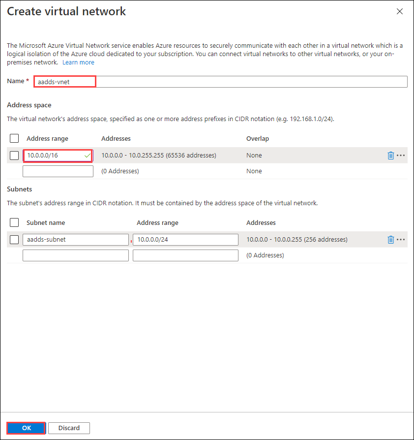

# Exercise 2: Azure AD Domain Services 

### **Task 1: Create prerequisites for AADDS**

1. Navigate **Azure Portal** (https://portal.azure.com) in your browser. 

2. Login to Azure with the username **<inject key="AzureAdUserEmail" />**

   

3. Enter password **<inject key="AzureAdUserPassword" />** and click on **Sign in**.

   
   
> Refer the **Environment Details** tab for any other lab credentials/details.
  
  

4. There will be a pop-up entitled **Stay signed in?** with buttons for **No** and **Yes** - Choose **No**.

   

5. You may encounter a popup entitled **Welcome to Microsoft Azure** with buttons for **Start Tour** and **Maybe Later** - Choose **Maybe Later**.

   

6. In Azure Portal search for **Subscription** and click on **Subscriptions**.

   
   
7. Click on your subscription.

   
   
8. Under Settings blade Click on **Resource Providers**.

   
   
9. Now search for **Microsoft.AAD** and make sure Microsofr.ADD is **Registered**.

   
   
> In case the **Microsoft.AAD is not registred** then follow the **step 10** *.

10. Click on **Microsoft.AAD** Resource Provider and click on **Register**.

   

### **Task 2: Deploy AADDS**

1. On the Azure portal menu or from the Home page, select **Create a resource**.

   

2. Enter Domain Services into the search bar, then choose Azure AD Domain Services from the search suggestions.

   

3. On the Azure AD Domain Services page, click on **Create**.

   
    
4. Configure Basics blade with following settings.
      
   - **Subscription**: Select your subscription.
   - **Resource Group** : Select **WVD-RG**
   - **DNS domain name**: **Default value**
   - **Region**: select **East US**
   - **SKU**: **Standard**
   - **Forest type**: **User**

   
       
5. Then click **Next**.

6. In Networking tab under **Virtual network**, Click on **Create new**.
        
   

7. Configure your new virtual network with following settings and then click **Ok**.

   - **Name**: **aaddss-vnet**
   - **Address range**: **10.0.0.0/16**

  

8. You will return to Networking tab, make sure subnet **(new)aads-subnet-01 (10.0.0.0/24)** is selected by default.

   

   Click on **Next**.

9. Click on **Review + Create** button.

    

10. Now click on **Create** Button.

    
    
11. A popup will appear, Click on **OK**.

    
    
    **Wait for the Deployment to complete, It will take approx 30 minutes to deploy.**


### **Task 3: Update Virtual Network DNS**

1. After deployment completes, go back to Azure portal home, and search for resource group and click on **Resource Groups**.
    
   
    
2. Now click on your **WVD-RG** resource group.

   
    
3. Click on **first NIC card**.

   
    
4. Note down the **Private IP** of first NIC card.

    
    
5. Now go back to your **WVD-RG** resource group and click on **second NIC card**.

    
    
6. Note down the **Private IP** of the second NIC card.

    
    
7. Go back to the **WVD-RG** resource group, and click on **aadds-vnet-01**.

    
    
8. Now under **Settings** bade click on **DNS servers**.

    
    
9. Under DNS server select **custom** and paste the IP address of first and second NIC card noted in step 19 and 21.
    
    
     
10. click on **Save**.
     
    

### **Task 4: Create new AD users**

1. In your azure portal, click on the **Cloud Shell** icon.

   
   
2. In the Cloud Shell window that opens at the bottom of your browser window, select **PowerShell**.

   

3. Click on **Show Advanced Settings**.

   

4. Use exisiting hands-on-lab-SUFFIX resource group and for:

    - **storage account:** Create new and enter **sa{uniqueid}**, for example: sa204272.
    - **file share:** Create new and enter **fs{uniqueid}**, for example: fs204272.
    
   

5. After the terminal launches it will look like this.

   

6. Now copy and paste the following script:

```
$domain = ((Get-AzADUser | where {$_.Type -eq "Member"}).UserPrincipalName.Split('@'))[1]
$password= ConvertTo-SecureString "Azure1234567" -AsPlainText -Force
$users = @("domainjoinadmin@$domain","wvduser-01@$domain","wvduser-02@$domain")
$users | foreach{
    if((Get-AzADUser -UserPrincipalName $_) -ne $null){
    Remove-AzADUser -UserPrincipalName $_ -Force
   }
}
New-AzADUser -DisplayName "Domain Join Admin" -MailNickname "DomainJoinAdmin" -Password $password -UserPrincipalName "domainjoinadmin@$domain"
New-AzADUser -DisplayName "WVD User-01" -MailNickname "WVDUser-01" -Password $password -UserPrincipalName "wvduser-01@$domain"
New-AzADUser -DisplayName "WVD User-02" -MailNickname "WVDUser-02" -Password $password -UserPrincipalName "wvduser-02@$domain"
```

7. You will get output in the similar form shown below:

   

8. You can verify this by searching for **Azure Active Directory** in the search bar in Azure portal and then click on it.

   

9. In Azure active directory page, click on **Users** under **Manage** blade .

   
   
10. Here you can review the users created.

   

### **Task 5: Change passwords for the users created**

1. Now we will run the following script to change passwords for the users created.

2. Copy and paste the following script and hit enter.

```
$domain = ((Get-AzADUser | where {$_.Type -eq "Member"}).UserPrincipalName.Split('@'))[1]
$password= ConvertTo-SecureString "Azure1234567" -AsPlainText -Force
$users = @("domainjoinadmin@$domain","wvduser-01@$domain","wvduser-02@$domain")
$users | foreach{
    Update-AzADUser -UserPrincipalName $_ -Password $password
}
```

   

 > Wait for few seconds for the script to execute.
   
3. Output of the script will look like this.

   

4. Click **Next** on the bottom right of this page.
