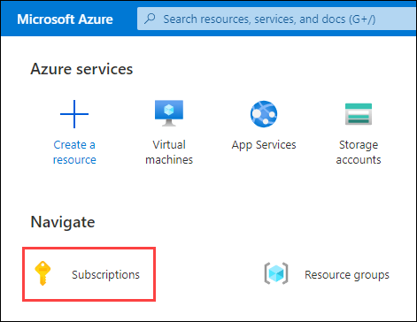
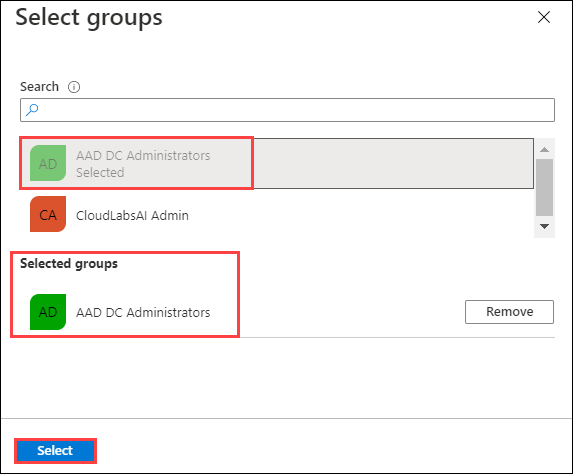

# Exercise 2: Azure AD Domain Services 

To deploy a Windows Virtual Desktop environment, we need a pre-created windows domain (e.g: contoso.com). This can be created by using one of the following methods:
1.	Azure Active Directory Domain Services (AADDS)
2.	Windows Active Directory
In this exercise, we are using AADDS, which is an Azure PaaS resource. It will host the Windows domain needed to create the WVD session hosts. By default, the domain name used in AADDS will be your Azure Tenant name (e.g: ***azurehol1057.onmicrosoft.com***)


### **Task 1: Create prerequisites for AADDS**

**A.**	Register Microsoft.AAD Resource Provider
The resource provider Microsoft.AAD should be registered in our subscription to deploy AADDS. If it is not already registered, we need to register it from the Azure portal.


1. Navigate **Azure Portal** (https://portal.azure.com) in your browser. 

2. Login to Azure with the username **<inject key="AzureAdUserEmail" />**

   

3. Enter password **<inject key="AzureAdUserPassword" />** and click on **Sign in**.

   
   
> **Note**: Refer the **Environment Details** tab for any other lab credentials/details.
  
   

4. There will be a pop-up entitled **Stay signed in?** with buttons for **No** and **Yes** - Choose **No**.

   

5. You may encounter a popup entitled **Welcome to Microsoft Azure** with buttons for **Start Tour** and **Maybe Later** - Choose **Maybe Later**.

   

6. In Azure Portal click on **Subscriptions** present under **Navigate**.

   
   
7. Open your =subscription by clicking on it.

   
   
8. Then under **Settings** blade click on **Resource Providers**.

   
   
9. Now search for **Microsoft.AAD** and make sure Microsoft.ADD is **Registered**.

   
   
> In case the **Microsoft.AAD** is not registred then follow **step 10**.

10. Click on **Microsoft.AAD** Resource Provider and then click on **Register**.

    

### **Task 2: Deploy AADDS**

In this task we will be creating a Azure Active Directory Domain Services.

1. Select **Create a resource** from the Azure portal homepage.

   

2. Enter **Domain Services** into the search bar, then choose **Azure AD Domain Services** from the search suggestions.

   

3. On the Azure AD Domain Services page, click on **Create**.

   
    
4. Configure Basics blade with following settings.
      
   - Subscription: *Select the default subscription*.
   - Resource Group: *Select **WVD-RG** from the drop down*.
   - DNS domain name: *Default value*
   - Region: **East US**, *this should be same as the region of your resource group*.
   - SKU**: **Standard**
   - Forest type: **User**

   
       
5. Then click **Next**.

6. Now in **Networking** tab click on **Create new** under **Virtual network**.
        
   

7. Configure your new virtual network with following settings and then click **Ok**.

   - Name: **aadds-vnet**
   - Address range: *By default the address range will be **10.0.0.0/24**,so make it -* **10.0.0.0/16**
   
   Under **Subents**, add the following:
   - Subnet name: **aadds-subnet**
   - Address range: **10.0.0.0/24**
 >**Note:** This subnet will be used to deploy Azure Active Directory Domain Service.  

   

8. Make sure the subnet **(new)aads-subnet-01 (10.0.0.0/24)** is selected against **Subnet**.

   

9. Click on **Next**.

10. Make sure that both **All Global Administrator of the Azure AD directory** & **Members of AAD DC Administrators group** boxes are unchecked. Then click on **Review + Create** button.

   

11. Now click on **Create** Button.

   
    
12. Click **OK** on getting a popup saying **You should know**.

   
   
 >**Note:** The Deployment will take approx 30 minutes to deploy. Till then continue with next step.

13. Now navigate to the **WVD-RG** , then go to **Overview** and open **aadds-vnet**.

   

14. Select **Subnets** given under **Settings** blade, then click on **+Subnet** to add new subnet.

   

15. Now add following configuration and select **OK**:

    - Name: **sessionhosts-subnet**
    - Address Range: **10.0.1.0/24**
 >**Note:** **sessionhosts-subnet** will be used for the purpose of deploying resources related to session hosts.
    

16. Once created it will appear under **Subnets** as shown below:

   
  
 >**Note:** Wait for the deployment of Azure Active Directory Domain Serive to complete. Then only you can start Task 3. 

### **Task 3: Update Virtual Network DNS**

In this task we will be using private IP address of the two network interface cards created while deploying AADDS and use it to configure DNS server of *aadds-vnet*.
By default, Virtual Network uses Azure's own DNS servers to resolve the DNS queries. Since we have deployed AADDS, this queries should now be pointed to the new DNS servers, for AADDS to function properly.

1. After deployment completes, go back to Azure portal, select **Resource Groups** under **Navigate**.
    
   
    
2. Now click on your **WVD-RG** resource group to open it.

   
    
3. In the resource group there are two NIC cards.

   

4. Open both the NIC cards and copy their **Private IP**.

   
   
   
    
5. Go back to the **WVD-RG** resource group and click on **aadds-vnet**.

   
    
6. Now under **Settings** blade click on **DNS servers**. Then select **custom** and paste the IP address of first and second NIC card you copied in earlier step.

   
     
7. Click on **Save**.
     
   

### **Task 4: Create new AD users**

In this task we will use cloud shell to create three users i.e. *WVDUser-01*, *WVDUser-02* to access the windows virtual desktop and *DomainJoinAdmin* to domain join session hosts.

1. In your azure portal, click on the **Cloud Shell** icon.

   
   
2. In the Cloud Shell window that opens at the bottom of your browser window, select **PowerShell**.

   

3. Click on **Show Advanced Settings**.

   

4. Use exisiting resource group - **WVD-RG** from the drop down and for:

    - Storage Account: Select **Create new** and enter **sa{uniqueid}**, for example: sa204272.
    - File Share: Select **Create new** and enter **fs{uniqueid}**, for example: fs204272.
    
   

5. After the terminal launches it will look like this.

   

6. Now copy and paste the following script in the console and hit **Enter** to run it completely:

   ```
   $domain = ((Get-AzADUser | where {$_.Type -eq "Member"}).UserPrincipalName.Split('@'))[1]
   $password= ConvertTo-SecureString "Azure1234567" -AsPlainText -Force
   $users = @("domainjoinadmin@$domain","wvduser-01@$domain","wvduser-02@$domain")
   $users | foreach{
       if((Get-AzADUser -UserPrincipalName $_) -ne $null){
       Remove-AzADUser -UserPrincipalName $_ -Force
      }
   }
   New-AzADUser -DisplayName "Domain Join Admin" -MailNickname "DomainJoinAdmin" -Password $password -UserPrincipalName "domainjoinadmin@$domain"
   New-AzADUser -DisplayName "WVD User-01" -MailNickname "WVDUser-01" -Password $password -UserPrincipalName "wvduser-01@$domain"
   New-AzADUser -DisplayName "WVD User-02" -MailNickname "WVDUser-02" -Password $password -UserPrincipalName "wvduser-02@$domain"
   ```

 >**Note:** The above script will create three users i.e. *WVDUser-01*, *WVDUser-02* and *DomainJoinAdmin* and set their passwords to "*Azure1234567*". DomainJoinAdmin user will be used to domain join session hosts to the AADDS.

7. You will get output in the similar form shown below:

   

8. You can verify this by navigating to Azure Active Directory.

9. On the homepage search for Azure Active in the search bar and then select **Azure Active Directory**.

   

9. In Azure active directory page, click on **Users** present under **Manage** blade.

   
   
10. Here you can review the users created.

    

11. Copy and Paste the usernames for all three users in notepad.

    

  >**Note:** Make sure to copy paste the the usernames of the users as you will need this throughout the lab.

### **Task 5: Add membership for DomainJoinAdmin User**

In this task we will be adding "*DomainJoinAdmin*" to *AAD DC Administrators* group which will enable this user to domain join session hosts to the Azure Active Directory Domain Services.

1. Navigate back to Azure active directory page, click on **Users** under **Manage** blade .

   
   
2. Click on **DomainJoinAdminUser** to open it.

   

3. Select **Groups** under **Manage**, then click on **+ Add Membership**. 

   

4. Select **AAD DC Administrators**. Once selected it will show up under selected groups then click on **Select**.

   

5. This will show the added membership.

   

### **Task 6: Change passwords for the users created**

1. Now we will run a script to change passwords for the users created.

2. Copy and paste the following script and hit enter.

   ```
   $domain = ((Get-AzADUser | where {$_.Type -eq "Member"}).UserPrincipalName.Split('@'))[1]
   $password= ConvertTo-SecureString "Azure1234567" -AsPlainText -Force
   $users = @("domainjoinadmin@$domain","wvduser-01@$domain","wvduser-02@$domain")
   $users | foreach{
       Update-AzADUser -UserPrincipalName $_ -Password $password
   }
   ```

  > The above script will reset the passwords for WVDUser-01, WVDUser-02 and DomainJoinAdmin to Azure1234567, as user needs to reset password after registering to AADDS.

  

  >**Note:** Wait for few seconds for the script to execute.
   
3. Output of the script will be similar to the one shown below.

  

4. Click on the **Next** button.
