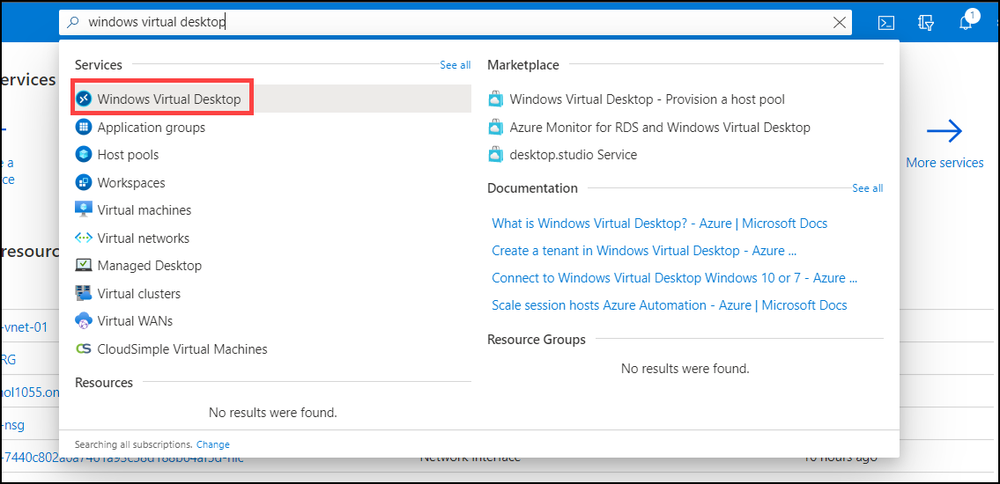
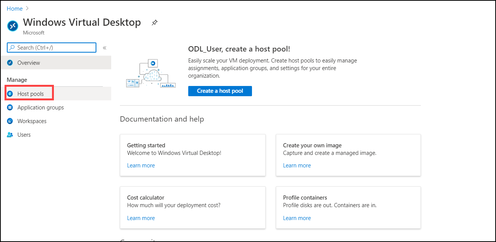
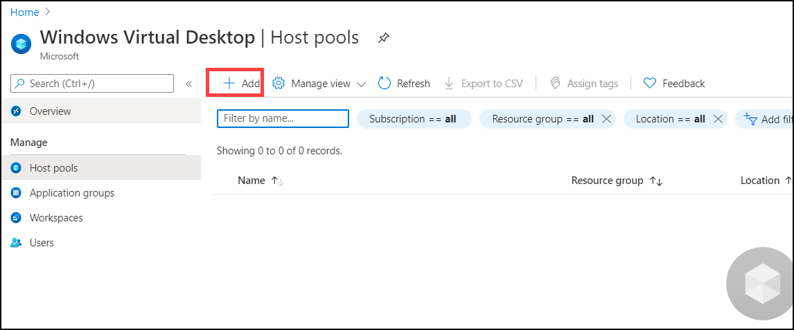
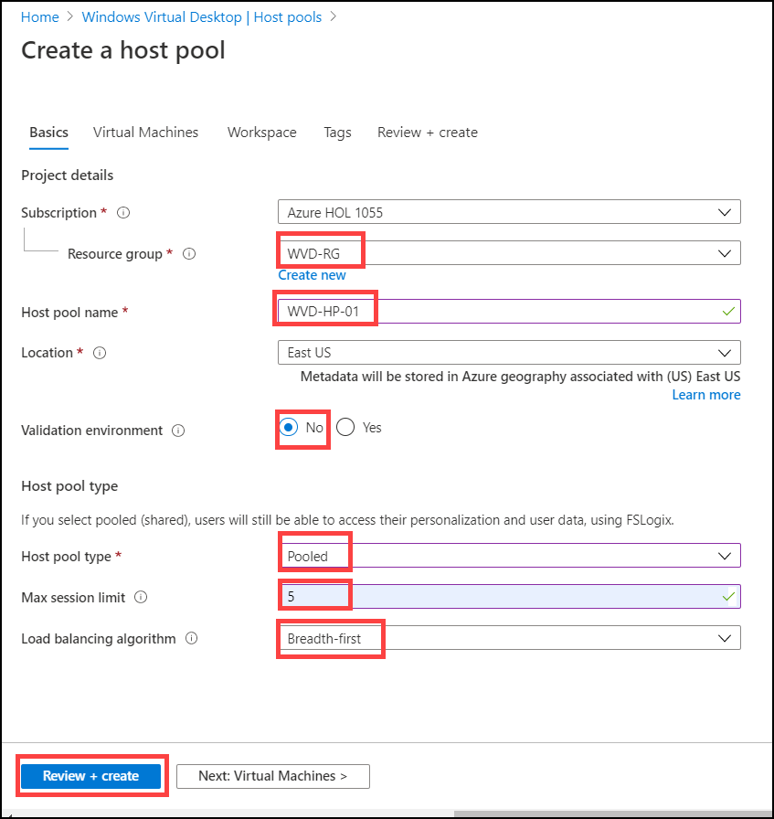
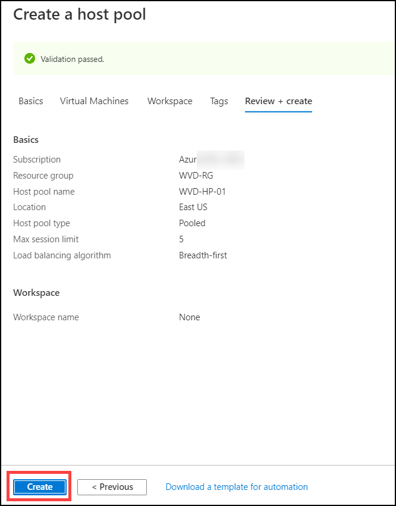
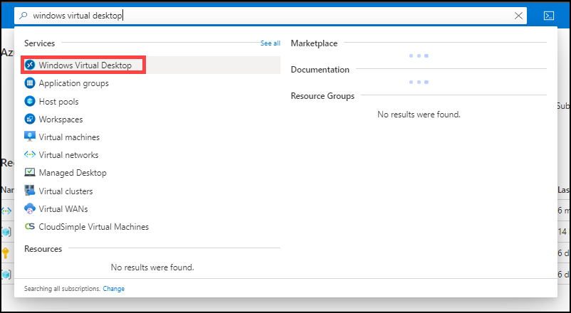
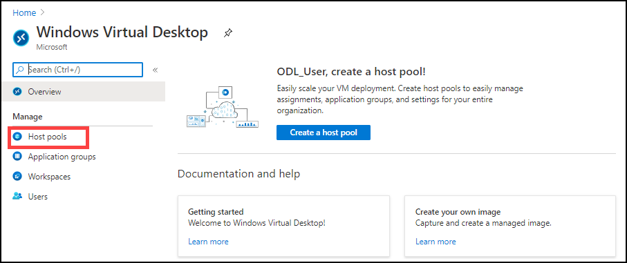
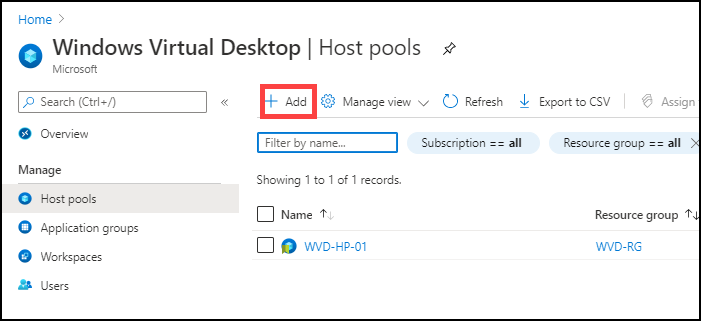
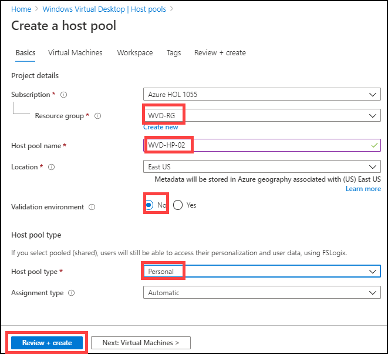
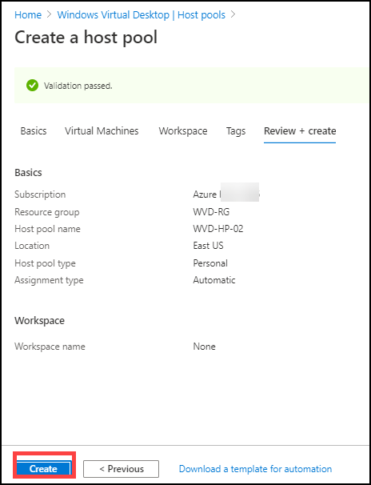

# Exercise 3: Create Host Pools 

## **Task 1: Create a Host Pool of ‘Pooled’ type**

Host pools are a collection of one or more identical virtual machines within Windows Virtual Desktop environments. Each host pool can contain an app group that users can interact with as they would on a physical desktop. 

1. Login to the Azure portal using the credentials in the Lab Environments section. 

2. In the search bar, search for ‘Windows Virtual Desktop” and you will see a resource that shows up in the same name. Click on it. 

   

4. In the management tab, select **Host pools**. 

   

5. Click on **+ Add** to add new Host Pool. 

   

6. Under Basics configure Host pool with following values.
    
   **A.** Project Details – Defines the environment 

      **Subscription**: Choose the default subscription

      **Resource Group**: Choose the default pre-created Resource Group

      **Host Pool Name**: *WVD-HP-01* 

      **Location**: Choose the location of the pre-created resource Group
   
   
   
   
   **B.** Host Pool Type – Defines the type of host pool. 

      **Host pool type**: *Pooled*
      
      **Max session Limit**: *5*
     
      **Load Balancing Algorithm**: *Breadth First*
     
      Then click on **Review + Create**
     
     
     
     
7. Click on **Create**.
 
    
    

## Task 2: Create a Host Pool of ‘Personal’ type
    
    
    
1. Login to the Azure portal using the credentials in the Lab Environments section. 

2. In the search bar, search for ‘Windows Virtual Desktop” and you will see a resource that shows up in the same name. Click on it. 

   

4. In the management tab, select **Host pools**. 

   

5. Click on **+ Add** to add new Host Pool. 

   

6. Under Basics configure Host pool with following values.
 
   
   
   
   
   **A.** Project Details – Defines the environment 

      **Subscription**: Choose the default subscription

      **Resource Group**: Choose the default pre-created Resource Group

      **Host Pool Name**: *WVD-HP-02* 

      **Location**: Choose the location of the pre-created resource Group
   
   
   **B.** Host Pool Type – Defines the type of host pool. 

      **Host pool type**: *Personal*
     
     Then click on **Review + Create**
     
     
     
 7. Click on **Create**.
 
    
     
