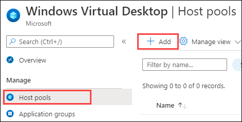

# Exercise 3: Create Host Pools 

Host pools are a collection of one or more identical virtual machines within Windows Virtual Desktop environments. Each host pool can contain an app group that users can interact with as they would on a physical desktop.

### **Task 1: Create a Host Pool of ‘Pooled’ type**

Host pools are a collection of one or more identical virtual machines within Windows Virtual Desktop environments. Each host pool can contain an app group that users can interact with as they would on a physical desktop. 

1. Navigate to **Azure portal** and search for Windowsin the search bar and select **Windows Virtual Desktop** from the suggestions.

   

2. Now select **Host pools** under **Manage** blade and then click on **+ Add** to add new Host Pool.

   

3. Under Basics configure Host pool with following values.
    
   **A.** **Project Details –** Defines the environment 

      - Subscription: *Choose the default subscription*.
      - Resource Group: *Select **WVD-RG** from the drop down*.
      - Host Pool Name: **WVD-HP-01**
      - Location: East US, *basically this should be same as the region of your resource group*.      
      - Validation environmet: **No**
      
   >**Note:** Validation host pools let you monitor service updates before rolling them out to your production environment.
      
      
   **B.** **Host Pool Type –** Defines the type of host pool. 

      - Host pool type: **Pooled** 
      
      >**Note:** Host Pools are of 2 types: Pooled and Personal.  Pooled is used to share the same Session Host (Virtual Machine) resources among multiple users, while Personal uses a dedicated Session host of individual user.

      - Max session Limit: **5**
      
      > **Note:** Max session Limit limits the simultaneous number of users on the same session host.
     
      - Load Balancing Algorithm: **Breadth First**
      
      > **Note:** Load Balancing Algorithm are of 2 types: *Breadth-first* and *Depth-first*. 
Breadth-first* load balancing distributes new user sessions across all available session hosts in the host pool. *Depth-first* load balancing distributes new user sessions to an available session host with the highest number of connections but has not reached its maximum session limit threshold.
     
   - Then click on **Review + Create**.
          
     

4. Click on **Create**.
 
    

### **Task 2: Create a Host Pool of ‘Personal’ type**
     
1. Navigate to **Host pools** again and then click on **+ Add** to add new Host Pool. 

   

2. Under Basics configure Host pool with following values.
  
   **A.** **Project Details –** Defines the environment 

      - Subscription: *Choose the default subscription*.
      - Resource Group: *Select **WVD-RG** from the drop down*.
     -  Host Pool Name: **WVD-HP-02** 
     -  Location: East US, *basically this should be same as the region of your resource group*.     
     - Validation environmet: **No**
   
   **B.** **Host Pool Type –** Defines the type of host pool. 

     - Host pool type: **Personal**     
     - Assignment type: **Automatic**
     - Then click on **Review + Create**
     
   
     
6. Click on **Create**.
 
    
     
7. Click on the **Next** button.
