# Exercise 4: Create Session Hosts

Session hosts are virtual machines created under host pools in which users can sign in ane access ther remote or Desktop application.

### **Task 1: Deploy 2 Windows 10 Enterprise multi-session Session Hosts to ‘Pooled’ Host Pool**

In this task we will be creating two session hosts i.e. WVD-HP01-SH-0 and WVD-HP01-SH-1 under WVD-HP-01 host pool which is of pooled type.

1. Navigate to Azure portal, then search for **Windows** in search bar and select **Windows Virtual Desktop** from the suggestions.

   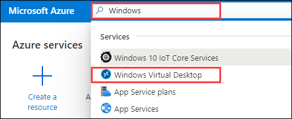
     
2. Click on **Host pools** and select **WVD-HP-01** to open it.

   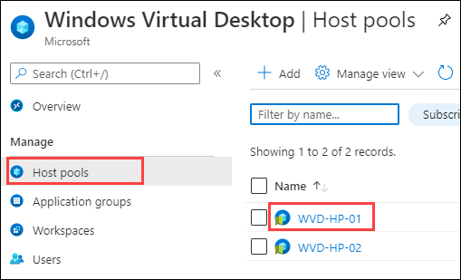
     
3. Now click on **Session hosts** present under **Manage** blade and then click on **+Add**.

   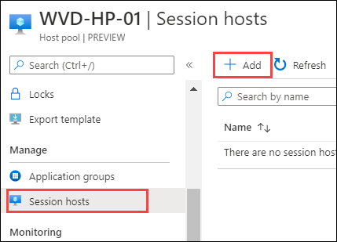
    
4. In the Session host creation page, leave the value at default and click on **Next: Virtual Machines**.

   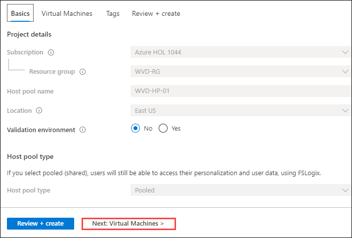
  
5. Configure the session hosts with following configuration.

   **A**. Session Host Specifications

     In this section, we provide the details of the VMs to be created as session Hosts.    

     - Resource Group: *Select **WVD-RG** from the drop down*.
     - Virtual machine location: **East US**, *location should be same as location of your resource group*.
     - Virtual machine size: **Standard DS1_V2**. *Click on **Change Size**, then select **DS1_V2** and click on **Select** as shown below*
   
   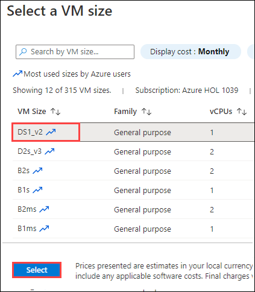

     - Number of VMs: **2**   
     - Name prefix: **WVD-HP01-SH** 
     - Image type: **Gallery**
     - Image: **Windows 10 Enterprise multi-session, version 1909 + Office 365 ProPlus**(choose from dropdown) 
     - OS disk type: **Standard SSD**
     - Use managed disks: **Yes**
   
   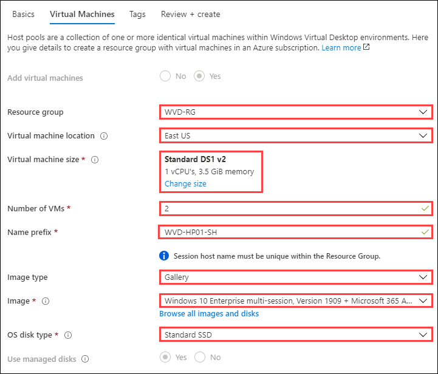
     
   
  **B**. Network and Security 
   - Subnet: *Choose **sessionhosts-subnet (10.0.1.0/24)** from the dropdown*.     
   - Leave all other values on default.
 
 **C**. Domain and Administrator account 
 
   - Specify Domain or Unit: **No**
   - AD domain join UPN: *Paste username of **DomainJoinAdminUser**,for example: DomainJoinAdminUser@azurehol1055.onmicrosoft.com.*
   - Password: **Azure1234567**
   - Confirm Password: **Azure1234567**  
   - Click on **Review + create**

   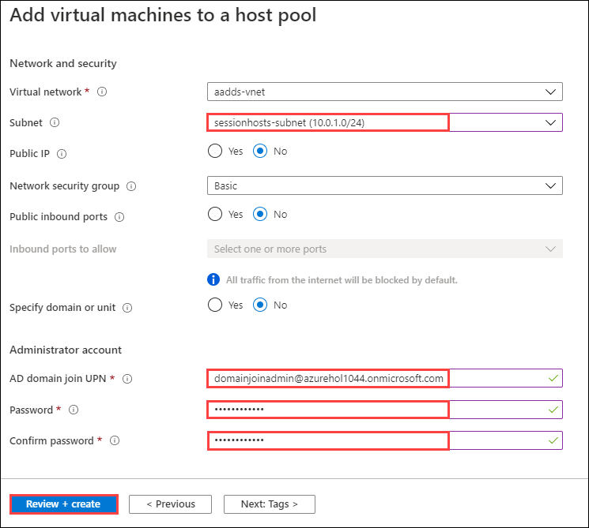   
   
6. Click on **Create**.

   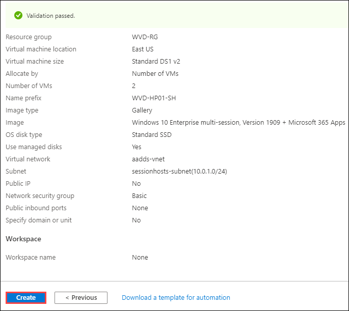
   
 >**Note:** We will be using sessionhosts-subnet for deploying resources related to session hosts.
   
  
### **Task 2: Deploy a Windows 10 Enterprise Session Hosts to ‘Personal’ Host Pool**

In this task we will be deploying a session host i.e. WVD-HP02-0 under WVD-HP-02 hostpool which is of personal type.

1. Now go back to **Host pools** and select **WVD-HP-02** to open it.

   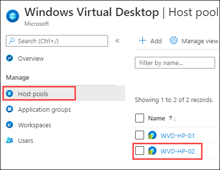
  
2. Now click on **Session hosts** present under **Manage** blade and then click on **+Add**.

   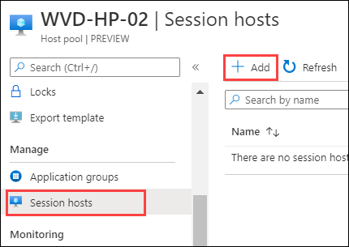
    
3. In the Session host creation page, leave the value at default and click on **Next: Virtual Machines**.

   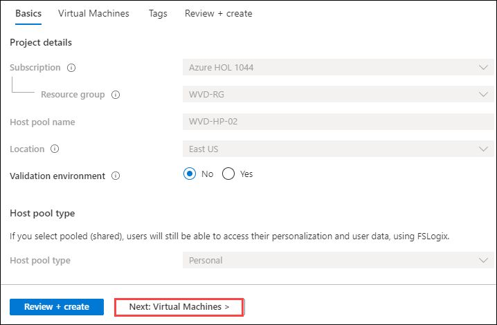
 
4. Configure the session hosts with following configuration.

   **A**. Session Host Specifications

    In this section, we provide the details of the VMs to be created as session Hosts. 
   
     - Resource Group: *Select **WVD-RG** from the drop down*.
     - Virtual machine location: **East US**, *location should be same as location of your resource group*.
     - Virtual machine size: **Standard DS1_V2**. *Click on **Change Size**, then select **DS1_V2** and click on **Select** as shown below*
   
   
      
     - Number of VMs: **1**    
     - Name prefix: **WVD-HP02-SH**
     - Image type: **Gallery**
     - Image: **Windows 10 Enterprise, version 1909(choose from dropdown)** 
     - OS disk type: **Standard SSD**
     - Use managed disks: **Yes** 
   
   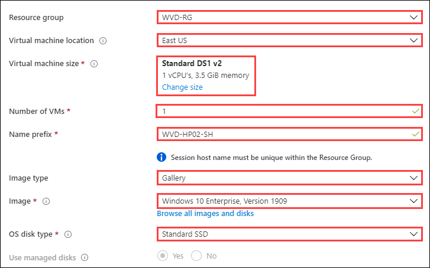

  **B**. Network and Security 
   - Subnet: *Choose **sessionhosts-subnet (10.0.1.0/24)** from the dropdown*.     
   - Leave all other values on default.
    
  **C**. Domain and Administrator account 

   - Specify Domain or Unit: **No** 
   - AD domain join UPN: *Paste username of **DomainJoinAdminUser**,for example: DomainJoinAdminUser@azurehol1055.onmicrosoft.com.*
   - Password: **Azure1234567**
   - Confirm Password: **Azure1234567**   
   - Click on **Review + create**
    
   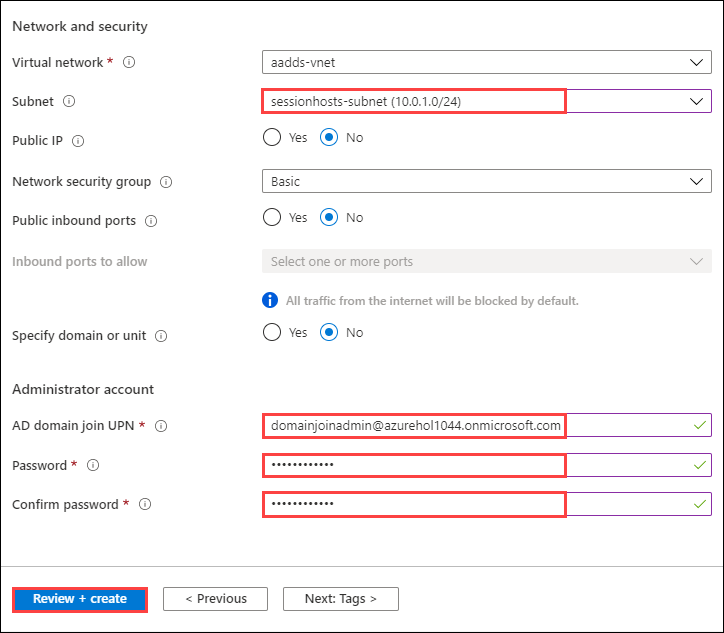
  
8. Click on **Create**.

   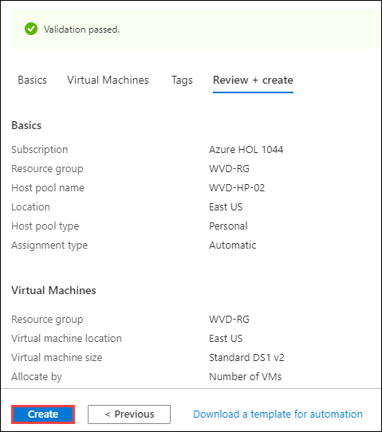

9. Click on the **Next** button.
