# Exercise 4: Create Session Hosts

### **Task 1: Deploy 2 Windows 10 Enterprise multi-session Session Hosts to ‘Pooled’ Host Pool**

1. In the search bar of Azure Portal, search for ‘Windows Virtual Desktop” and you will see a resource that shows up in the same name. Click on it.

   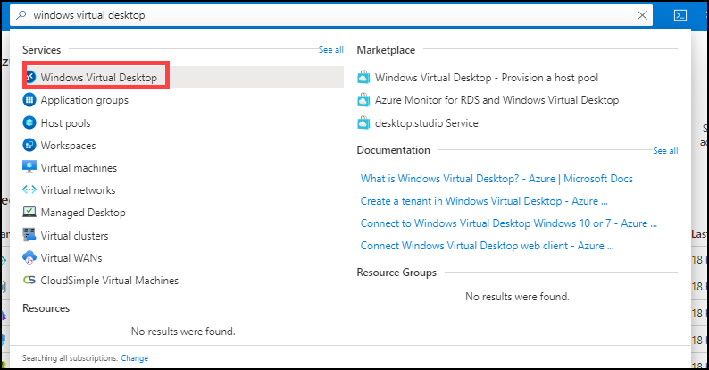
     
2. Click on **Host pools**.

   
     
3. Click on the Host pool **WVD-HP-01**.

   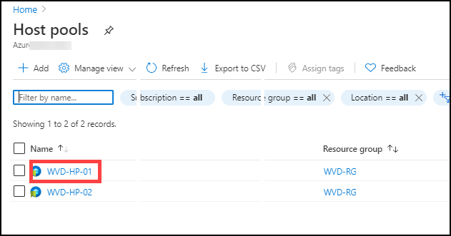
     
4. In the Host pool page under **Manage** blade click on **Session hosts**.

   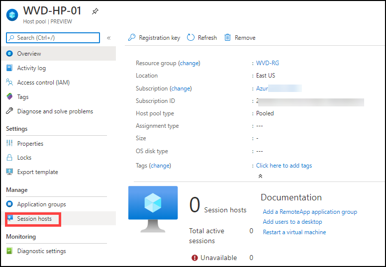
     
5. Click on **+ Add**.

   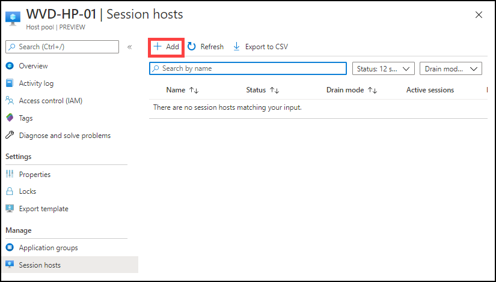
    
6. In the Session host creation page, leave the value at default and click on **Next: Virtual Macines**.

   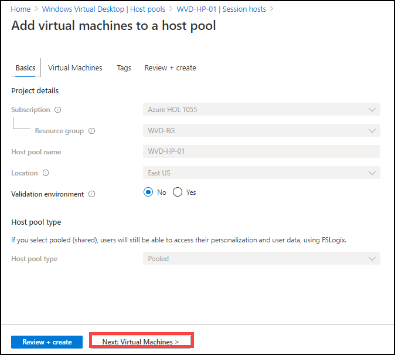
  
7. Configure the session hosts with following configuration.

   **A**. Session Host Specifications

In this section, we provide the details of the VMs to be created as session Hosts.    

   - Resource Group: **Choose the default pre-created Resource Group**

   - Virtual machine location: **Choose the location of the pre-created resource Group**

   - Virtual machine size: **Standard DS1_V2**. [Click on **Change Size**, then select **DS1_V2** and click on **Select** as shown below]
   
      

   - Number of VMs: **2**
   
   - Name prefix: **WVD-HP01-SH** 

   - Image type: **Gallery**

   - Image: **Windows 10 Enterprise multi-session, version 1909 + Office 365 ProPlus**(choose from dropdown) 

   - OS disk type: **Standard SSD**

   - Use managed disks: **Yes**
   
   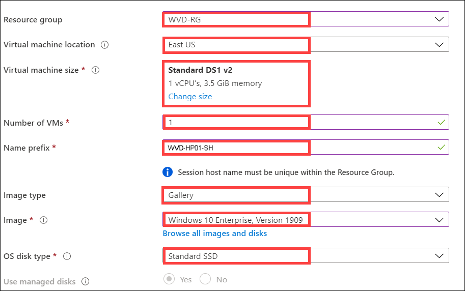
   
  **B**. Network and Security 
   - Leave all values on default.
 
   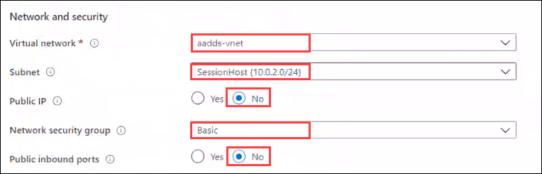
 
 **C**. Domain and Administrator account 
 
   - pecify Domain or Unit: **No**

   - AD domain join UPN: Paste username of **DomainJoinAdminUser**,for example: DomainJoinAdminUser@azurehol1055.onmicrosoft.com.

   - Password: **Azure1234567**

   - Confirm Password: **Azure1234567**
   
   - Click on **Review + create**

  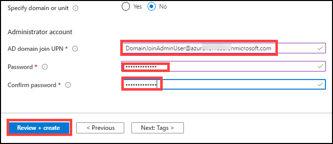

8. Click on **Create**.

   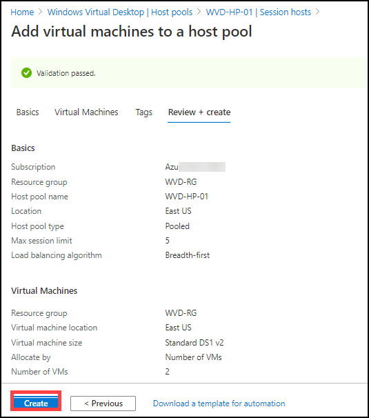
  
### **Task 2: Deploy a Windows 10 Enterprise Session Hosts to ‘Personal’ Host Pool**

1. In the search bar of Azure Portal, search for ‘Windows Virtual Desktop” and you will see a resource that shows up in the same name. Click on it.

   
  
2. Click on **Host pools**.

   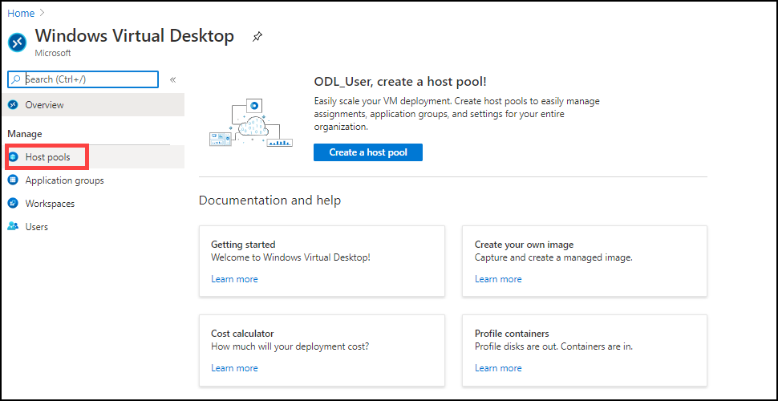
   
3. Click on the Host pool **WVD-HP-02**.

   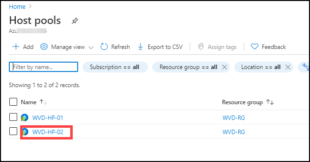
  
4. In the Host pool page under Manage blade click on **Session hosts**.

   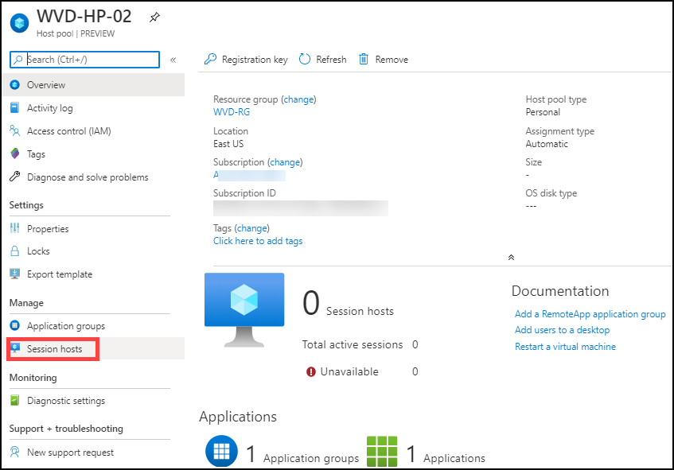
  
5. Click on **+ Add**.

   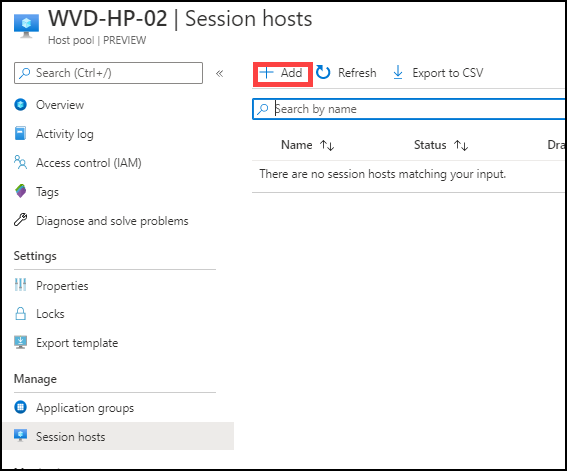
  
6. In the Session host creation page, leave the value at default and click on **Next: Virtual Macines**.

   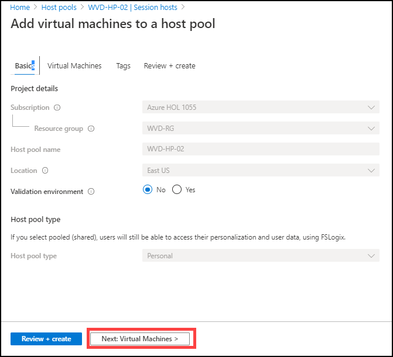
 
7. Configure the session hosts with following configuration.

   **A**. Session Host Specifications

   In this section, we provide the details of the VMs to be created as session Hosts. 
   
   - Resource Group: **Choose the default pre-created Resource Group**

   - Virtual machine location: **Choose the location of the pre-created resource Group**

   - Virtual machine size: **Standard DS1_V2**. [Click on **Change Size**, then select **DS1_V2** and click on **Select** as shown below]
   
      
      
   - Number of VMs: **1** 
   
   - Name prefix: **WVD-HP02-SH**

   - Image type: **Gallery**

   - Image: **Windows 10 Enterprise, version 1909(choose from dropdown)** 

   - OS disk type: **Standard SSD**

   - Use managed disks: **Yes** 
   
   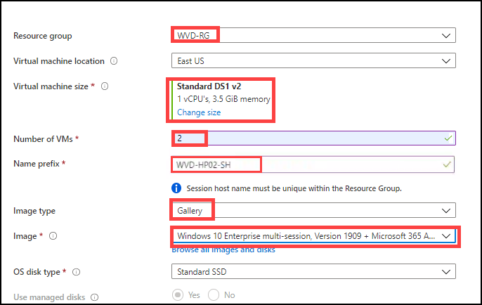

  **B**. Network and Security 
    - Leave all values on default.
 
   
 
  **C**. Domain and Administrator account 

   - **Specify Domain or Unit**: **No** 

   - AD domain join UPN: Paste username of **DomainJoinAdminUser**,for example: DomainJoinAdminUser@azurehol1055.onmicrosoft.com.

   - Password: **Azure1234567**

   - Confirm Password: **Azure1234567**
   
   - Click on **Review + create**
    
   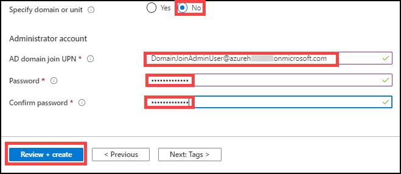
  
8. Click on **Create**.

   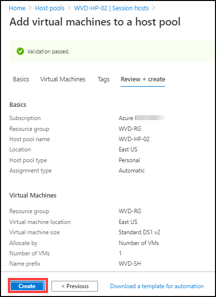

9. Click **Next** on the bottom right of this page.
