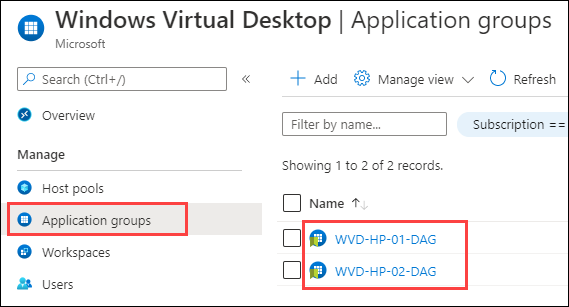
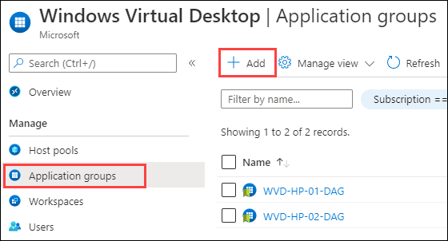
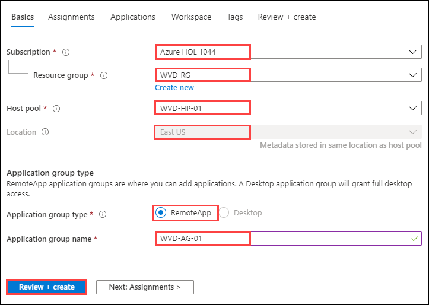
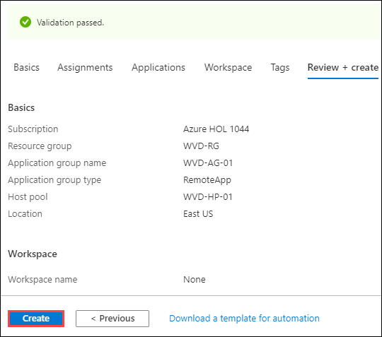

# Exercise 5: Create Application Groups

Application Group is a logical grouping of applications installed on session hosts in the host pool. They are of two types:
1.	Remote App
2.	Desktop

The default app group created for a new Windows Virtual Desktop host pool also publishes the full desktop. In addition, you can create one or more RemoteApplication groups for the host pool.

### **Task 1: Review application group of type ‘Desktop’ that is created by default**

Two application group of type ‘Desktop’ was created automatically while creating the host pool WVD-HP-01 and WVD-HP-02. We will be reviewing those two application groups here.

1. Navigate to Azure portal, then search for **Windows** in search bar and select **Windows Virtual Desktop** from the suggestions.

   
   
2. Click on **Application Groups** and review that application group named **WVD-HP-01-DAG** and **WVD-HP-02-DAG** are already present here.

   
  
  
## **Task 2: Create application groups of type Remote App**

In this task we will be creating a Remote app type application groups to deploy applications in our windows virtual desktop environment.

1. In the Application group page click on **+ Add**.

   
  
2. On the **Basics** section, fill the parameters as below: 
   
      - Subscription: *Select the default subscription*.
      - Resource Group: *Select **WVD-RG** from the drop down*.
      - Host Pool: **WVD-HP-01** (*This application group will be created under WVD-HP-01 hostpool*)
      - Location: **East US**, *this should be same as the region of your resource group*.
      - Application Group Type: **RemoteApp** 
      
 >**Note:** Application groups are of two types **Remote app** and **Desktop application**.

   - Application Group Name: **WVD-AG-01**

   - Click on **Review + create**
  
   

3. Click on **Create**.

   
   
4. Click on the **Next** button.
