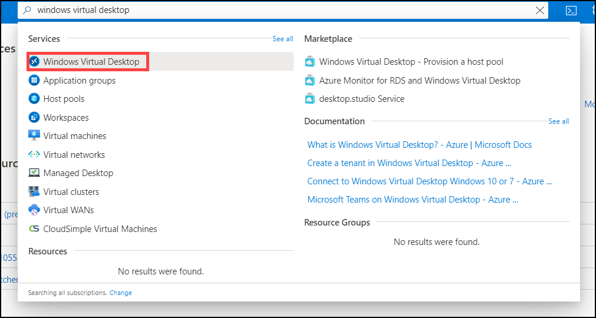
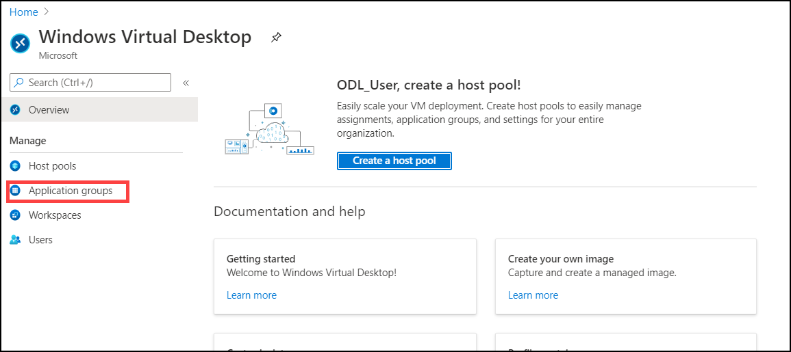
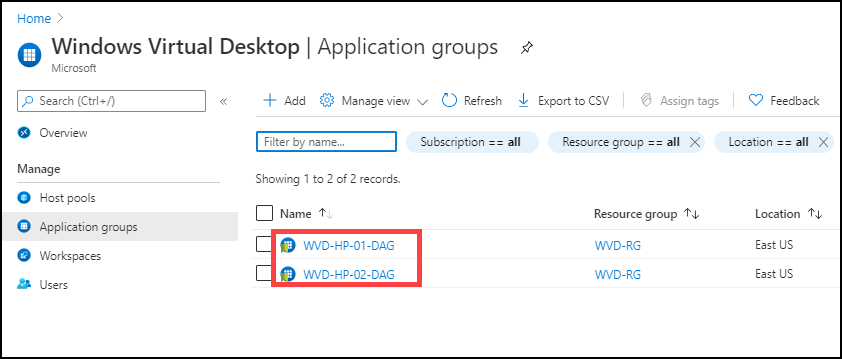
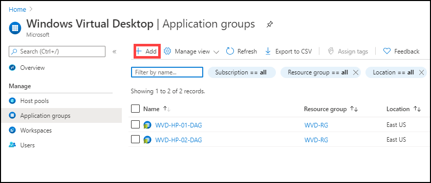
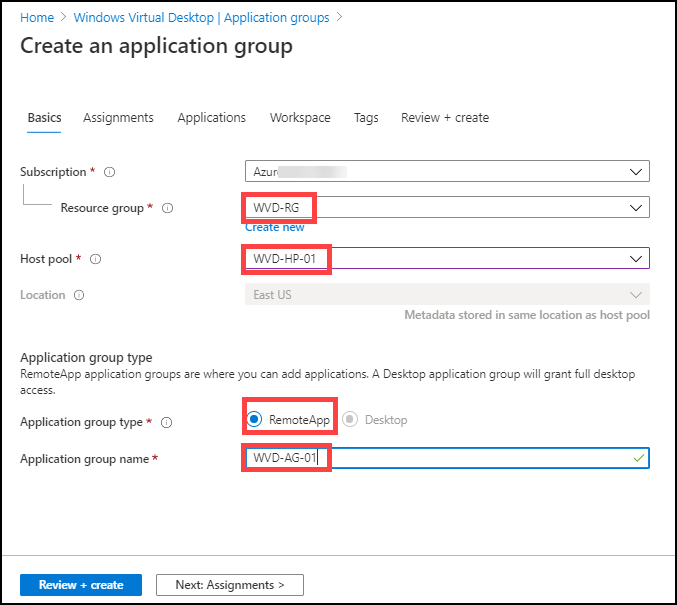
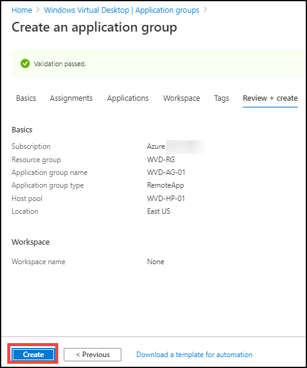

# Exercise 5: Create Application Groups

### **Task 1: Verify application group of type ‘Desktop’ is created by default**

1. In the search bar, search for ‘Windows Virtual Desktop” and you will see a resource that shows up in the same name. Click on it.

   
   
2. Click on **Application Groups**.

   
  
3. Verify that a application group named **WVD-HP-01-DAG** and **WVD-HP-02-DAG** is already present.

   
  
## Task 2: Create application groups of type ‘Remote App’

1. In the Application group page click on **+ Add**.

   
  
2. On the ‘Basics’ section, fill the parameters as below: 

   
   
      1) **Subscription**: Choose the default subscription.

      2) **Resource Group**: Choose the default pre-created Resource Group.

      3) **Host Pool:** **WVD-HP-01** (***This application group will be created under WVD-HP-01 hostpool***)

      4) **Location**:  Choose the default location

      5) **Application Group Type:** **RemoteApp** 

      6) **Application Group Name:** **WVD-AG-01**

      7) Click on **Review + create**
  
3. Click on **Create**.

   
   
4. Click on **Next** button.
