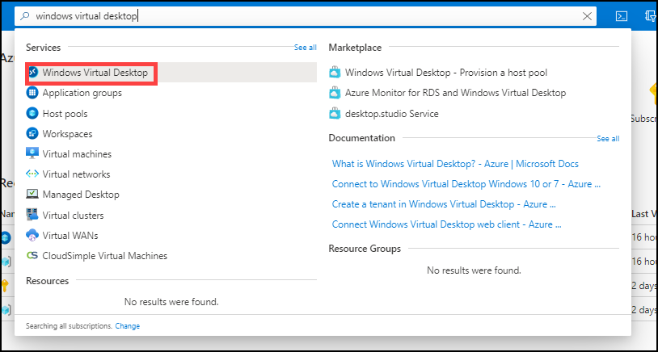
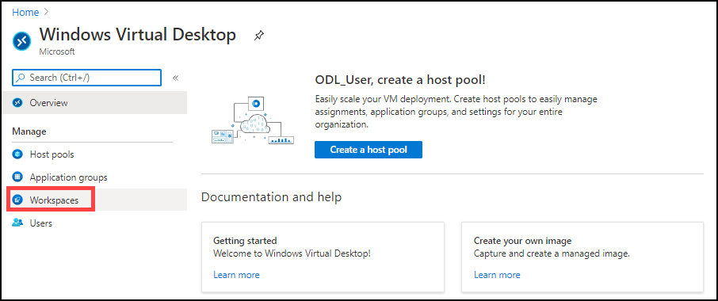
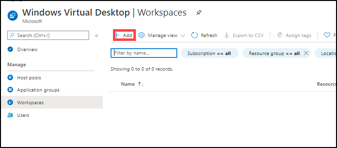
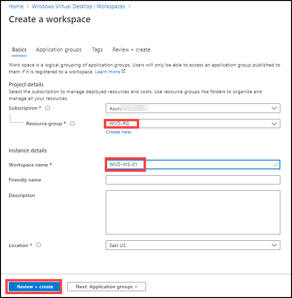
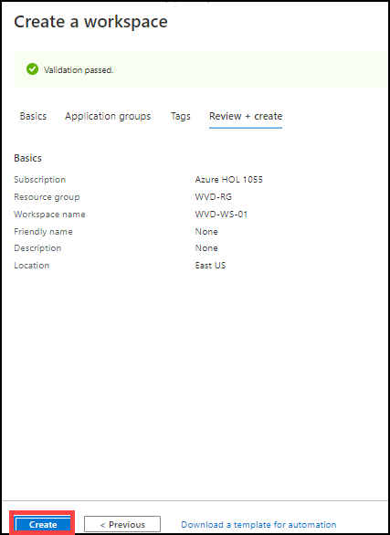
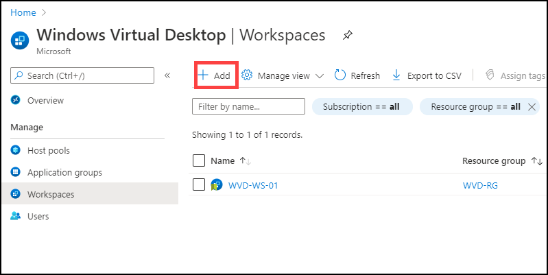
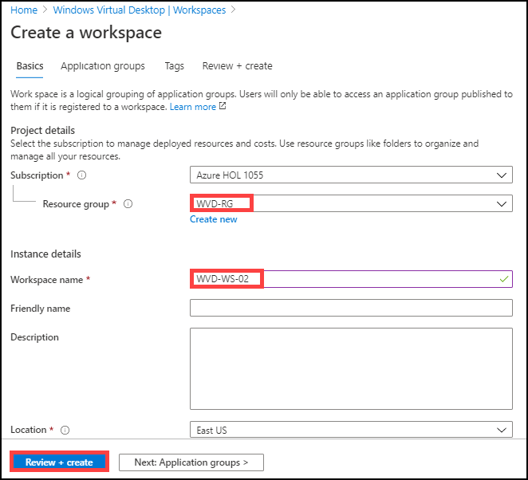
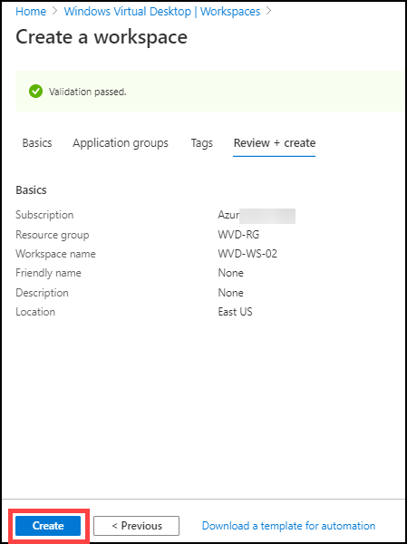

# Exercise 6: Create Workspaces

## Task 1: Create Workspaces

1. Login to the Azure portal using the credentials in the Lab Environments section.

2. In the search bar, search for ‘Windows Virtual Desktop” and you will see a resource that shows up in the same name. Click on it.

   
  
  
   
3. Click on **Workspaces**.

   
   
   
   
4. Click on **+ Add** to create a workspace.

   

5. Configure the worspace with following parameters.

   

   **Subscription**:  Default Subscription 
   
   **Resource Group**: *WVD-RG*

   **Workspace name**: *WVD-WS-01*

   **Location**: Default location of resource group
   
   Click on **Review + create**.
   
 
 
6. Click on **Create**.
 
   
 
   
   
7. Click on **+ Add** to create a workspace.

   

8. Configure the worspace with following parameters.

   

   **Subscription**:  Default Subscription 
   
   **Resource Group**: *WVD-RG*

   **Workspace name**: *WVD-WS-02*

   **Location**: Default location of resource group
   
   Click on **Review + create**.
   
 
 
9. Click on **Create**.
 
   
 
