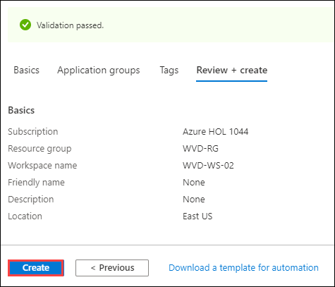

# Exercise 6: Create Workspaces

A workspace is a logical grouping of application groups in WVD. Each WVD application group must be associated with a workspace for users to see the remote apps and desktops published to them.

### **Task 1: Create Workspaces**

In this task we will be creating two workspaces, *WVD-WS-01* for WVDUser-01 and *WVD-WS-02* for WVDUser-02.

1. Navigate to Azure portal, then search for *Windows* in search bar and select **Windows Virtual Desktop** from the suggestions.

   
  
2. Click on **Workspaces** and then click on **+ Add** to create a workspace.

   
  
3. Configure the worspace with following parameters.:

   - Subscription: *Select the default subscription*.
   - Resource Group: *Select **WVD-RG** from the drop down*.
   - Workspace name: **WVD-WS-01**
   - Location: **East US**, *this should be same as the location of your resource group*.  
   - Click on **Review + create**.
 
   

6. Click on **Create**.
 
   
 
7. Go back to **Windows Virtual Desktop**, click on **Workspaces** and then click on **+ Add** to create second workspace.

   

8. Configure the worspace with following parameters.

   - Subscription: *Select the default subscription*.
   - Resource Group: *Select **WVD-RG** from the drop down*.
   - Workspace name: **WVD-WS-02**
   - Location: **East US**, *this should be same as the location of your resource group*.  
   - Click on **Review + create**.

   

9. Click on **Create**.
 
   
 
10. Click on the **Next** button.
