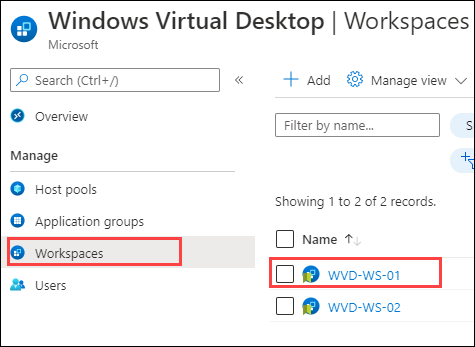
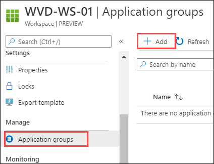
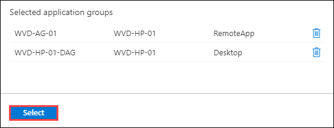
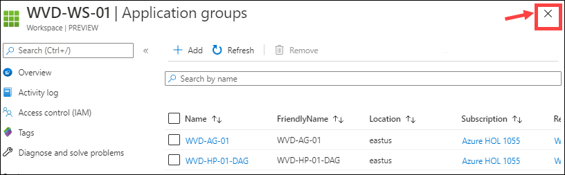
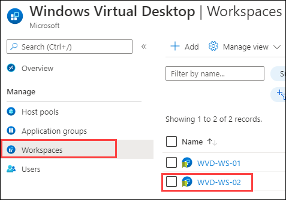
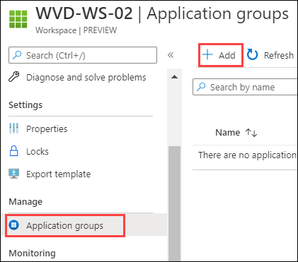
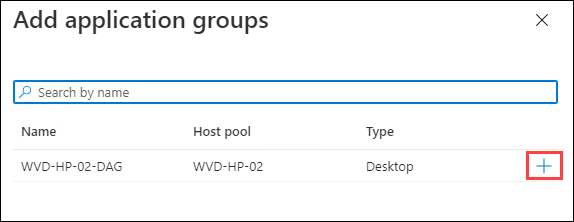
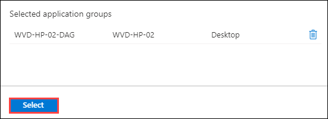

# Exercise 7: Register Application Groups

### **Task 1: Register the Application Groups to Workspace**

In this task we will be registering Application groups to workspaces in following series:

  - **WVD-WS-01:** *WVD-AG-01* and *WVD-HP-01-DAG*
  - **WVD-WS-02:** *WVD-HP-02-DAG*

1. Navigate to Azure portal, then search for *Windows* in search bar and select **Windows Virtual Desktop** from the suggestions.

   
   
2. Click on **Workspaces** then click on **WVD-WS-01**.

   
   
   
3. Now select on **Application groups** and click on **+ Add**.

   

4. Click on **Select**.

   

5. Click on the **X** icon to go back to workspaces.

      
   
6. Now click on **WVD-WS-02** workspace.

   
    
11. Then click on **Application groups** present under **Manage** blade and click on **+ Add**.

   
         
12. Click on **+** sign to add **WVD-HP-02-DAG** to the **WVD-WS-02** workspace.

   
 
14. Then click on **Select**.

   
  
15. Click on **Next** button.
