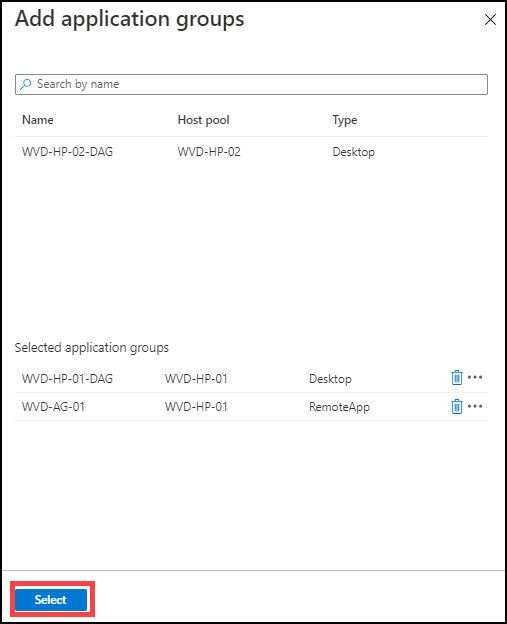
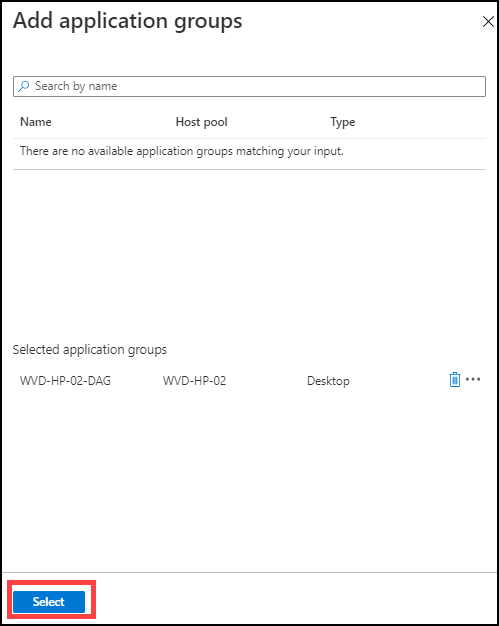

# Exercise 7: Register Application Groups

## Task 1: Register the Application Groups to Workspace

1. Login to the Azure portal using the credentials in the Lab Environments section.

2. In the search bar, search for ‘Windows Virtual Desktop” and you will see a resource that shows up in the same name. Click on it.

   
   
   
   
3. You will be directed towards the Windows Virtual Desktop management window. Here click on **Workspaces**.

   
   
   
   
4. Click on **WVD-WS-01** workspace.

   
   
   
   
5. On the **WVD-WS-01** window under manage blade, click on **Application groups**.

   

6. Click on **+ Add**.

   
   
   
   
7. Click on **+** and add **WVD-HP-01-DAG** and **WVD-AG-01** Application groups.

   
   
8. Click on **Select**.

   

9. Click on the **X** icon to go back to workspaces.

      
   
10. Now click on **WVD-WS-02** workspace.

    
    
11. On the WVD-WS-01 window under manage blade, click on **Application groups**.

    
   
   
   
12. Click on **+ Add**.

   
   
   
13. Click on **WVD-HP-02-DAG** to add it to the **WVD-WS-02** workspace.

   
   
   
   
14. Click on **Select**.

    
  
