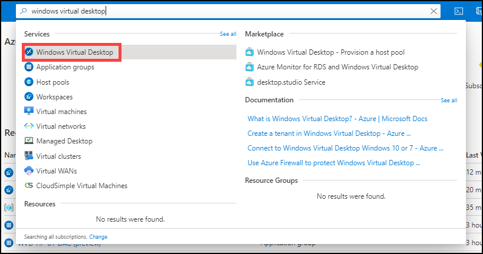
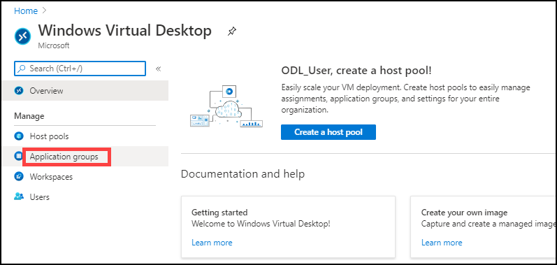
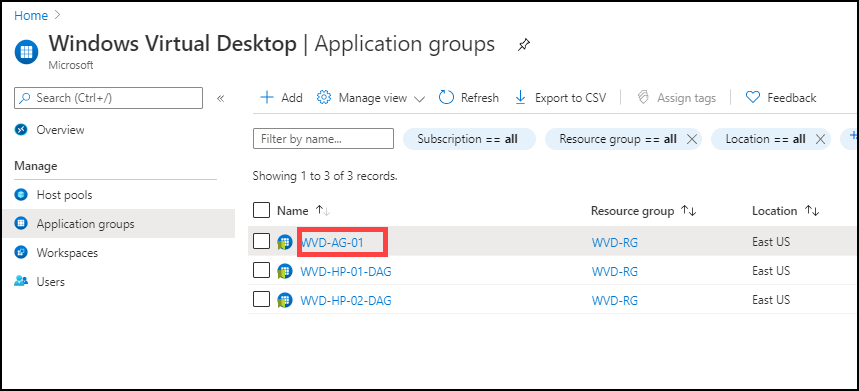
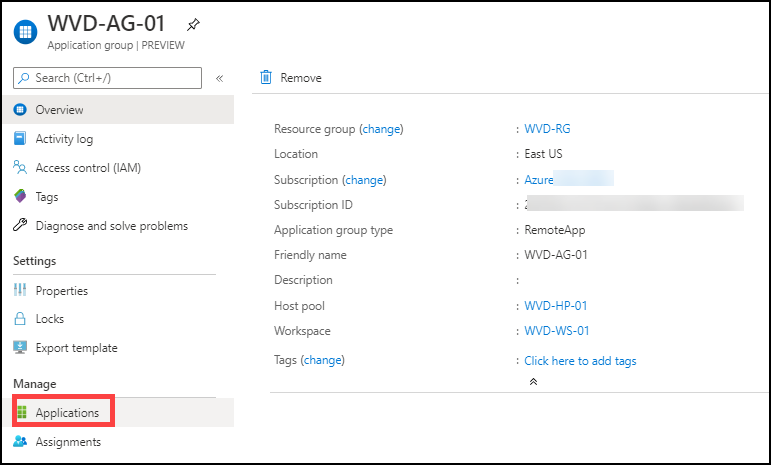
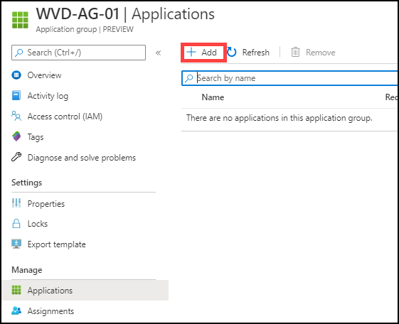
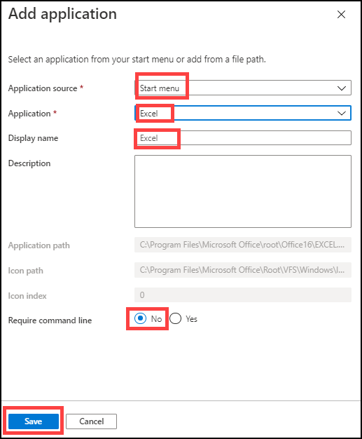
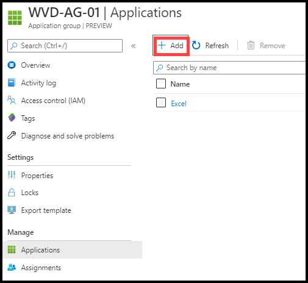
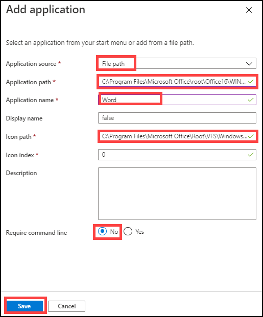

# Exercise 8: Publish Applications

The Published applications can be accessed directly from the wrokspace after the user sign in to windows virtual desktop, without launching the desktop environment.

## Task 1: Publish Applications from Start Menu

1. In the search bar, search for ‘Windows Virtual Desktop” and you will see a resource that shows up in the same name. Click on it.

   
   
   
   
2. You will be directed towards the Windows Virtual Desktop management window. Here click on **Application groups**.

   
   
   
   
3. Click on the **WVD-AG-01** application group.

   
   
   
   
4. On WVD-AG-01 page under Manage blade, click on **Applications**.

   
   
   
   
5. Click on **+ Add**.

   
   
   
   
6. Select following parameters to Publish application.
   
   - **Application Source**: *Start Menu* 
   
   - **Application**: *Excel*

   - Leave rest of the parameters to be on default settings and click on **Save**.
   
   
   
   
## Task 2: Publish Applications from using File Path

1. Click on **+ Add**.

   
   
   
   
2. Select following parameters to Publish application.
   
   - **Application Source**: *File path* 
   
   - **Application path**: *C:\Program Files\Microsoft Office\root\Office16\WINWORD.EXE* 
   
   - **Application name**: *Word*
   
   - **Icon path**: *C:\Program Files\Microsoft Office\Root\VFS\Windows\Installer\{90160000-000F-0000-1000-0000000FF1CE}\wordicon.exe*
   
   - Leave rest of the parameters to be on default settings and click on **Save**.
   
   
