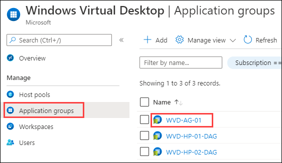

# Exercise 8: Publish Applications

The Published applications can be accessed directly from the wrokspace after the user sign in to windows virtual desktop, without launching the desktop environment. 

There are two ways to publish an application:

**1. Start menu:** We can easily deploy applications by selecting any application provided in the list.

**2. File path:** We can deploy applications using path of the application file from windows directory.

### **Task 1: Publish Applications from Start Menu**

In the following task we will be publishing Microsoft Office excel using start menu option. Here we can select the applications to be deployed from list of applications provided.

1. Navigate to Azure portal, then search for *Windows virtual* in search bar and select **Windows Virtual Desktop**.

   
   
2. Now click on **Application groups** and then click on the **WVD-AG-01** application group.

   
      
3. Click on **Applications** under **Manage** blade and then click on **+Add**.

   
  
4. Select following parameters to Publish application.
   
   - Application Source: **Start Menu**    
   - Application: **Excel**
   - Leave rest of the parameters to be on default settings and click on **Save**.
   
   
   
   
### **Task 2: Publish Applications from using File Path**

Here we will deploy Microsoft office word by manually providing the path of the word application file which will be in *.exe* format, and also manually providing path of the icon for the application.

1. Go back to **Applications** under **Manage** blade and then click on **+Add** .

   
  
2. Select following parameters to Publish application.
   
   - Application Source: **File path**    
   - Application path: **C:\Program Files\Microsoft Office\root\Office16\WINWORD.EXE**    
   - Application name: **Word**   
   - Icon path: **C:\Program Files\Microsoft Office\Root\VFS\Windows\Installer\{90160000-000F-0000-1000-0000000FF1CE}\wordicon.exe**   
   - Leave rest of the parameters to be on default settings and click on **Save**.
   
   

3. Click on the **Next** button.
