# Exercise 9: Assign Users to Application Groups

Assigning users to a specific application groups can allow users to have access to specific applications only.
   
   
## Assign Users to Application Groups

**A.** Assigning users to WVD-AG-01 application group.

1. In the search bar, search for ‘Windows Virtual Desktop” and you will see a resource that shows up in the same name. Click on it.

   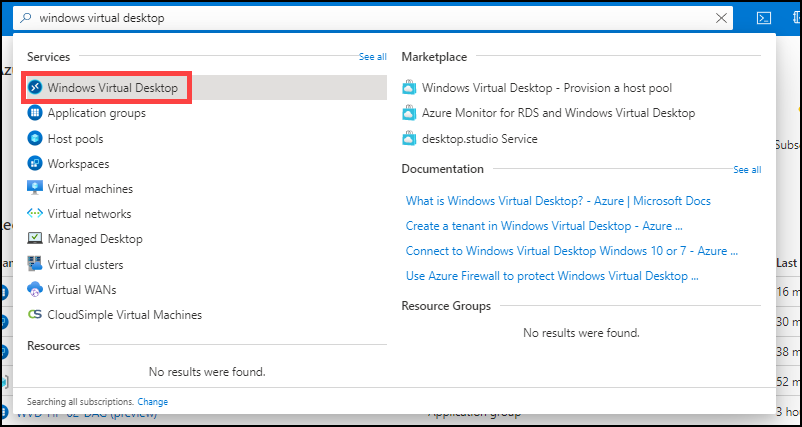
   
   
   
2. Click on **Application Groups**.

   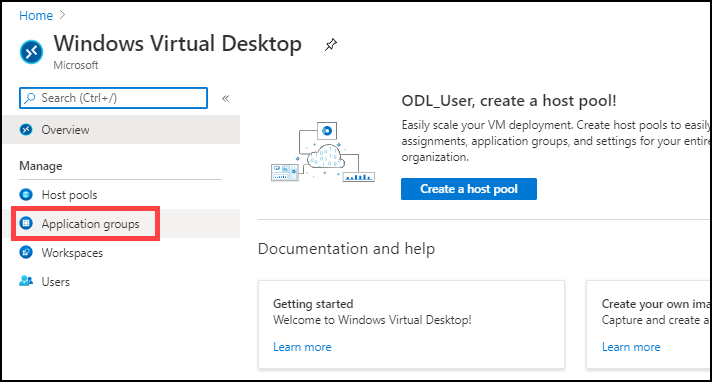
  
  
     
3. Click on **WVD-AG-01**.

   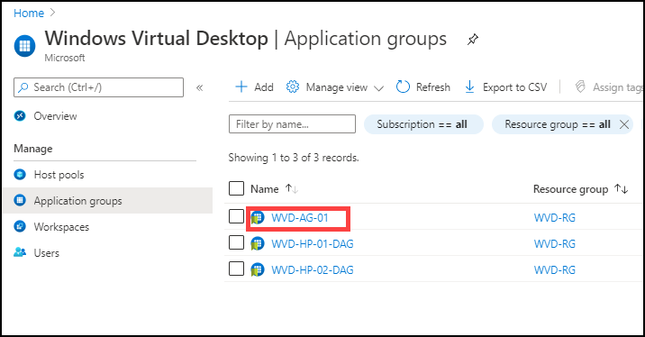
   
   
   
4. Click on **Assignments**.

   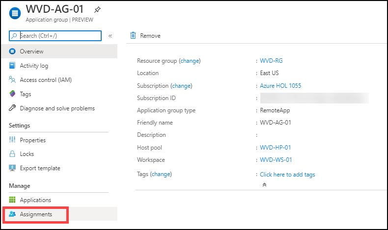
   
   
   
5. Click on **+ Add**.

   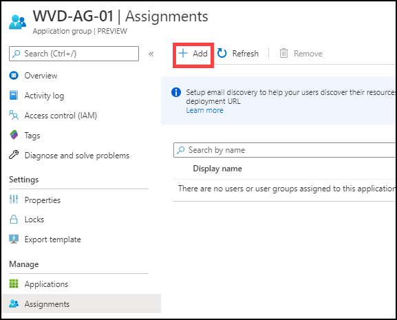
   
   
   
6. In search bar search for *WVDUser* and select **both** the users the users by clicking on them.

   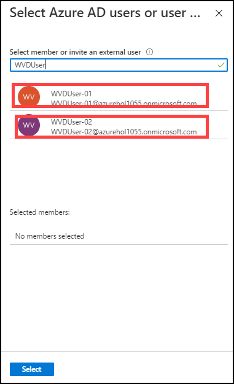
   
   
   
7. Now click on **Select**.

   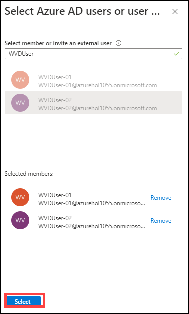

> This will allow both WVDUser-1 and WVDUser-02 access to WVD-AG-01 application group.

   Now return back to application group page.
   

**B.** Assigning users to WVD-HP-01-DAG application group.

  
1. To assign users to second application group, click on **WVD-HP-01-DAG**.

   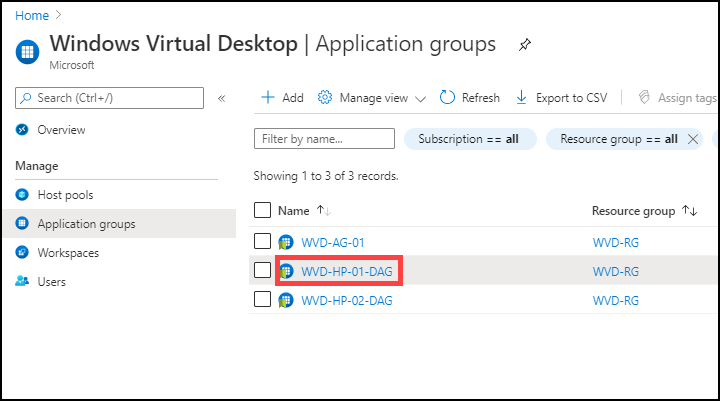
   
   
   
2. Click on **Assignments**.

   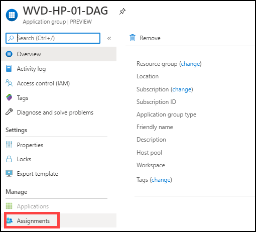
   
   
   
3. Click on **+ Add**.

   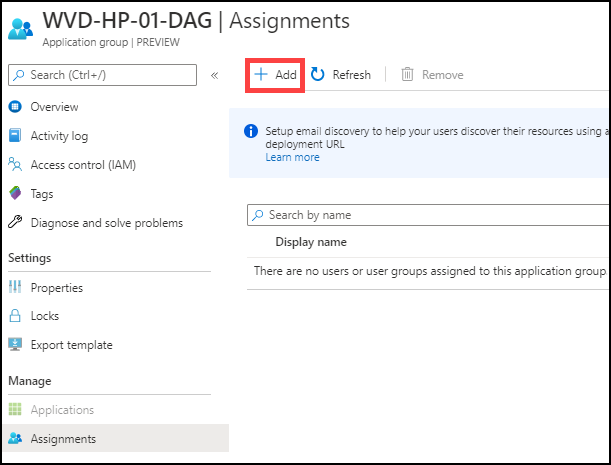
   
   
   
4. In search bar search for *WVDUser* and select **both** the users by clicking on them.

   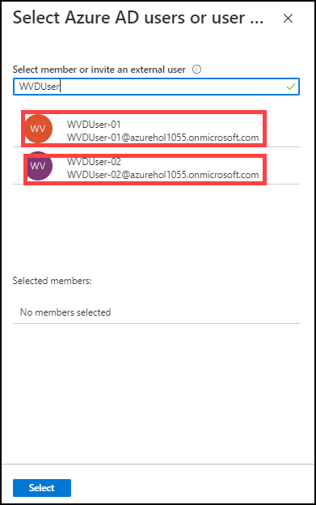
   
   
   
5. Now click on **Select**.

   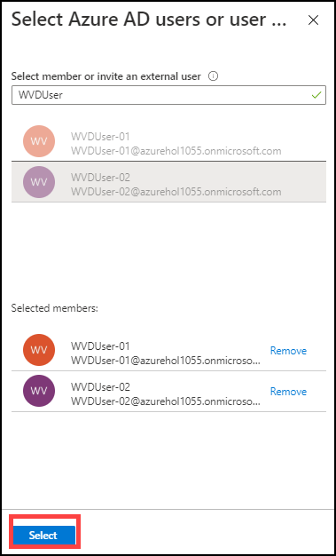
   
   
> This will allow both WVDUser-1 and WVDUser-02 access to WVD-HP-01-DAG application group.

   
   Now return back to application group page.
   
   

**C.** Assigning users to WVD-HP-02-DAG application group.

1. To assign users to second application group, click on **WVD-HP-02-DAG**.

   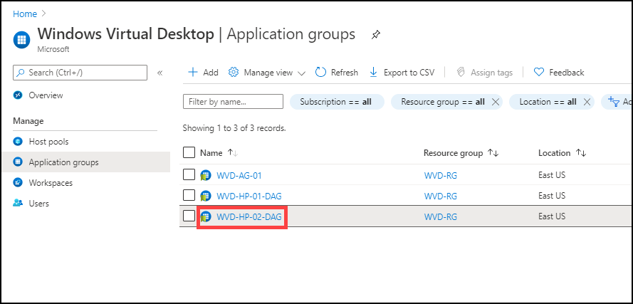
   
   
   
2. Click on **Assignments**.

   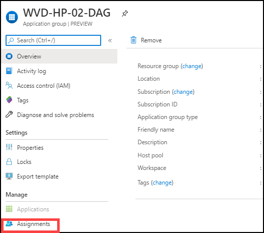
   
   
   
3. Click on **+ Add**.

   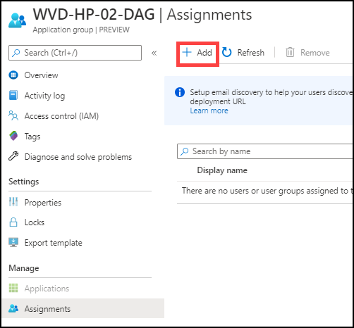
   
   
   
4. In search bar search for *WVDUser-02* and select the **WVDUser-02**.

   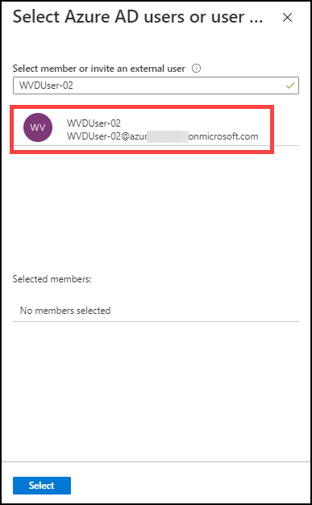
   
   
   
5. Now click on **Select**.

   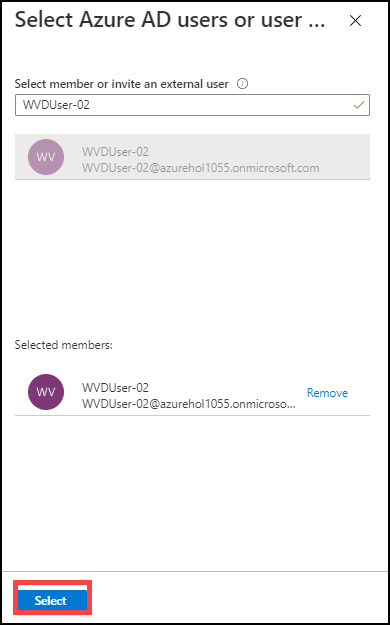
   
   
   
> This will allow WVDUser-02 access to WVD-AG-02 application group.   
