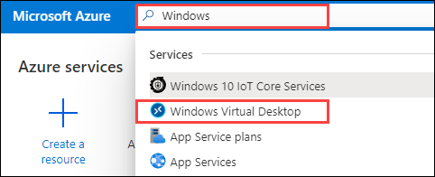
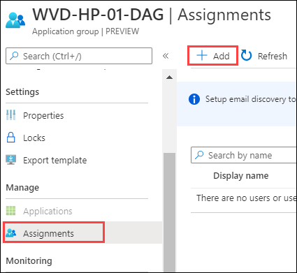

# Exercise 9: Assign Users to Application Groups

Assigning users to a specific application groups can allow users to have access to specific applications only.
   
   
## Assign Users to Application Groups

**A.** Assigning users to WVD-AG-01 application group.

1. Navigate to Azure portal, then search for **Windows** in search bar and select **Windows Virtual Desktop**.

   
   
2. Now click on **Application groups** and then click on the **WVD-AG-01** application group.

   
  
4. Click on **Assignments**, then click on **+ Add**.

   
  
5. In search bar search for **WVD** and select **both** the users the users by clicking on them.

   
   
6. Once selected they will show up under **Selected items**, then click on **Select**.

   

> This will allow both WVDUser-1 and WVDUser-02 access to WVD-AG-01 application group.

**B.** Assigning users to WVD-HP-01-DAG application group.

1. Now return back to application group page and click on **WVD-HP-01-DAG** to open it.
  
   
  
2. Click on **Assignments**, then click on **+ Add**.

   

3. In search bar search for **WVD** and select **both** the users by clicking on them.

   
  
4. Once selected they will show up under **Selected items**, then click on **Select**.

   
   
   
> This will allow both WVDUser-1 and WVDUser-02 access to WVD-HP-01-DAG application group.

**C.** Assigning users to WVD-HP-02-DAG application group.

1. Now return back to application group page to assign users to second application group. Here click on **WVD-HP-02-DAG**.

   
   
2. Click on **Assignments**, then click on **+ Add**.

   
  
3. In search bar search for **WVDUser-02** and select the **WVDUser-02**.

   
  
5. Once selected it will show up under **Selected items**, then click on **Select**.

   
   
> This will allow WVDUser-02 access to WVD-AG-02 application group.   

6. Click on **Next** button.
