# Exercise 10: Access Applications

## Task 1: Access published applications via Web browser

### Access the published applications using browser

Now as we have published Desktop and Applications in previous step, now we will be accessing them. 

1. Use the link ***aka.ms/wvdarmweb*** and enter your **credentials** to login. 

   **Username**: *WVDUser-01@azurehol1055.onmicrosoft.com*
   
   **Password**: *Azure1234567*

   
  

2. Now you will be inside the WVD dashboard with all the Desktop and Applications assigned to WVDUser01 accesable. Click on any one of the applications to access it. 

   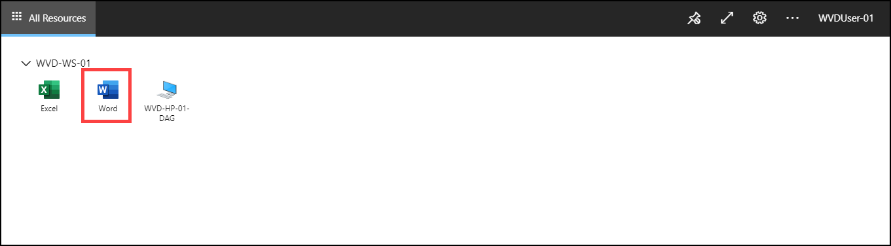

3. Click on **Allow** for the prompt.

   

4. Enter your **credentials** to access the application.

   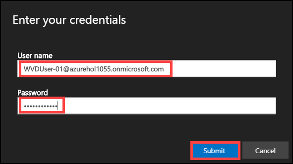
   
  Click on **Submit**.
   
5. Your application will launch.

   

### Access the published Desktop using browser

6. Use the link ***aka.ms/wvdarmweb*** and enter your credentials to login. 

   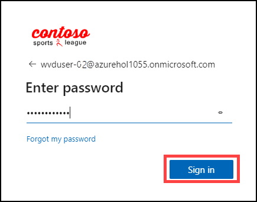
   
   **Username**: *WVDUser-02@azurehol1055.onmicrosoft.com*
   
   **Password**: *Azure1234567*

7. Now you will be inside the WVD dashboard with all the Desktop and Applications accesable to WVDUser-02. Click on the **Desktop** to access it. 

   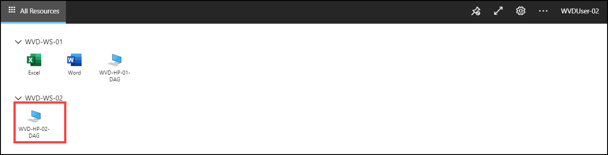

8. Click on **Allow** for the Prompt.

   

9. Enter your **credentials** to access the application.

   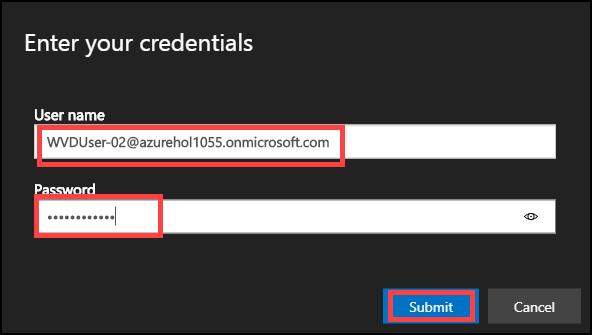

   click on **Submit**.

10. Your virtual Desktop will launch and it should be ready to use. 

   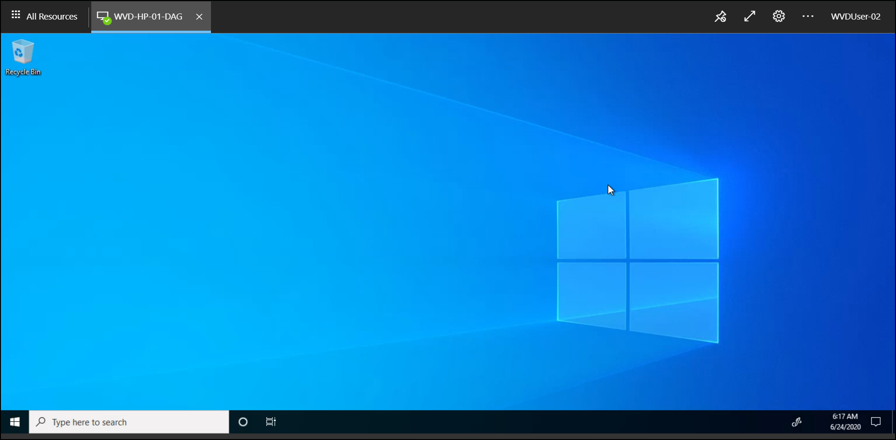
     
     
     
## Task 2: Access published applications via Remote Desktop Client

### Access the published applications using WVD client

   
1. Download the **WVD Client** on your local machine from the following [**Link**](https://docs.microsoft.com/en-us/azure/virtual-desktop/connect-windows-7-and-10) and install it.
   
   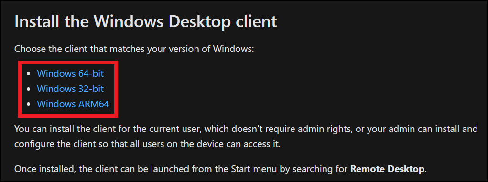
   
   
   
2. After installation, in your local machine go to **Start** and search for **Remote desktop** and open the application with exact icon as shown below.

   
   
   
   
3. After the application opens click on **Subscribe with URL**.

   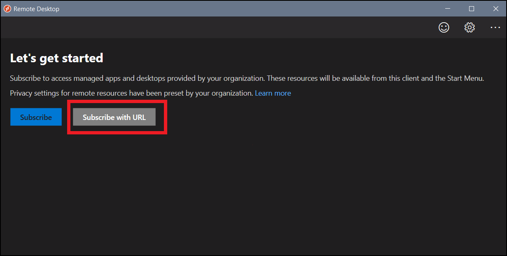
  
  
  
4. Enter the following URL **https://rdweb.wvd.microsoft.com/api/arm/feeddiscovery** and click on **Next**.

   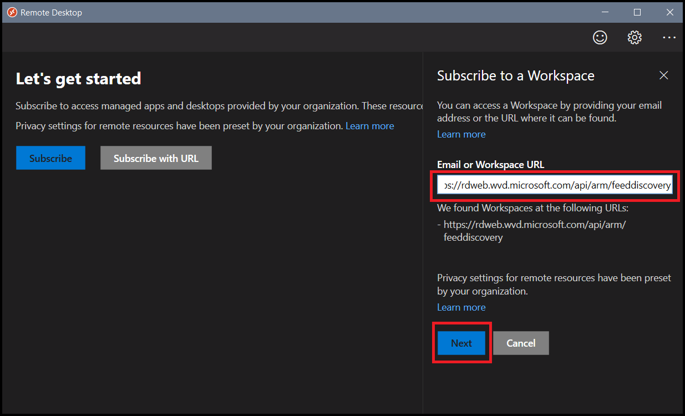
   
   
   
5. Enter your **credentials** to access the workspace.

   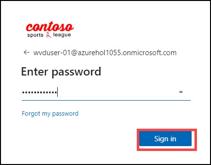
   
   
   **Username**: *WVDUser-02@azurehol1055.onmicrosoft.com*
   
   **Password**: *Azure1234567*
   
   
   
6. Make sure to **uncheck** Allow my organization to manage my device.

   Click on **Yes**.

   
   
   
   
7. Now you will be inside the WVD dashboard with all the desktop and applications assigned to *WVDUser01*. Click on any one of the applications to access it. 

   

8. Click on **Allow** for the prompt.

   

9. Enter your **credentials** to access the application.

   
   
  Click on **Submit**.
  
  
   
10. Your application will launch.

   

### Access the Workspace Desktop using WVD Client

1. In your local machine go to **start** and search for **Remote desktop** and open the Application with exact exact Icon as shown below.

   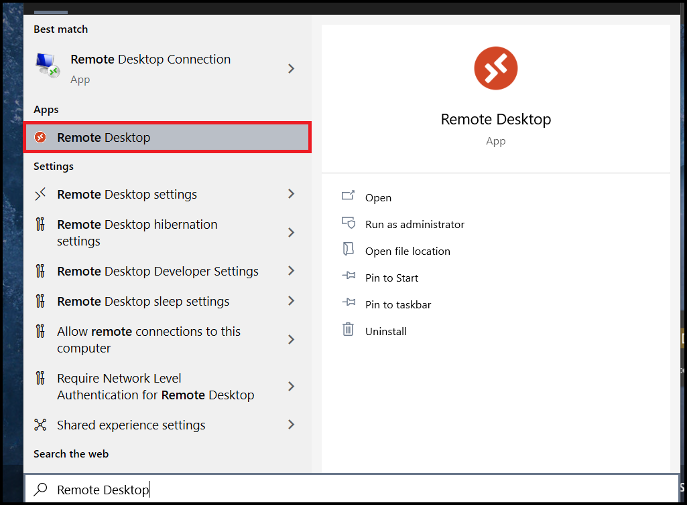

2. After the application opens click on **Subscribe with URL**.

   
  
  
3. Enter the following URL **https://rdweb.wvd.microsoft.com/api/arm/feeddiscovery** and click on **Next**.

   
   
   
4. Enter your **credentials** to access the Workspace.

   
   
   
   **Username**: *WVDUser-02@azurehol1055.onmicrosoft.com*
   
   **Password**: *Azure1234567*
   
   
   
5. Make sure to **uncheck** Allow my organization to manage my device.

   Click on **Yes**.

   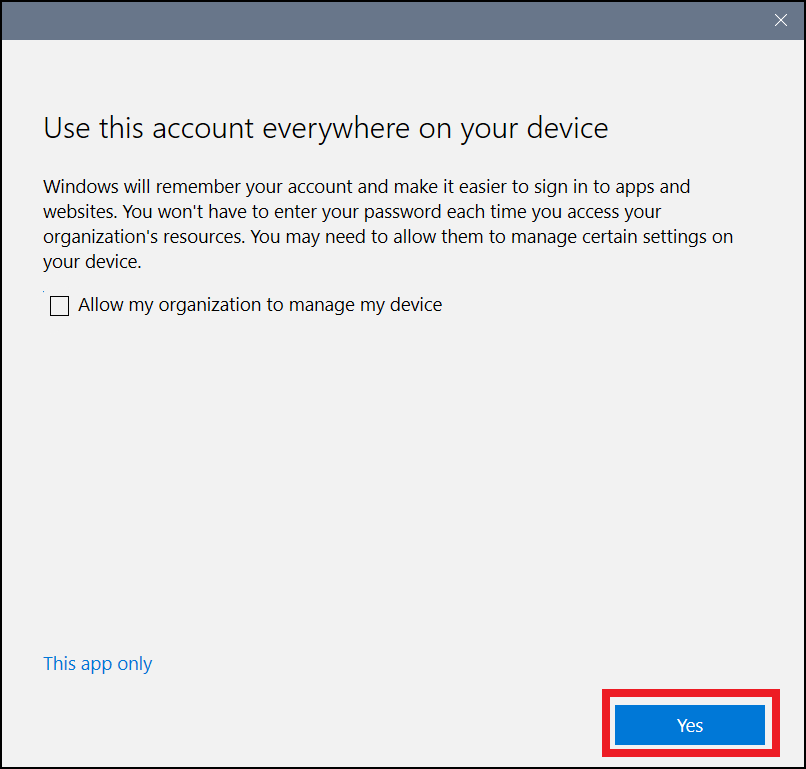
   
   
   
6. Now you will be inside the WVD dashboard with all the Desktop and Applications accesable to *WVDUser-02*. Click on the **Desktop** to access it. 

   

7. Click on **Allow** for the Prompt.

   

8. Enter your **credentials** to access the application.

   

   click on **Submit**.
   

9. Your virtual Desktop will launch and it should be ready to use. 

   
