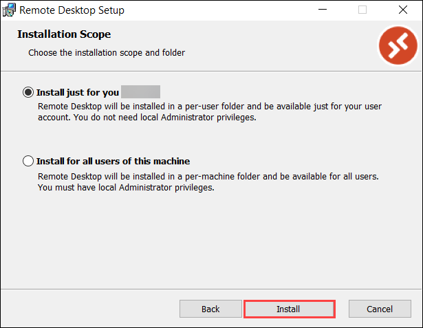
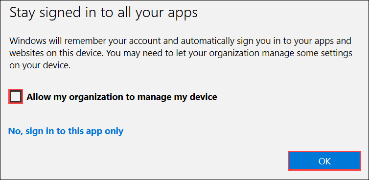
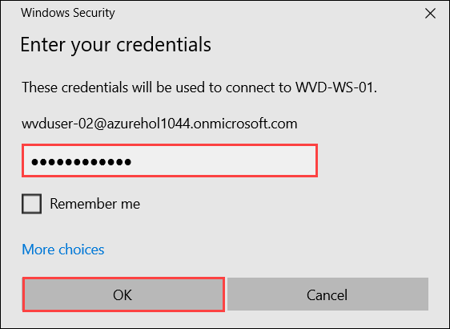

# Exercise 10: Access Applications

## **Task 1: Access published applications via Web browser**

### **Subtask 1: Access the published applications using browser**

Now as we have published Desktop and Applications in previous step, now we will be accessing them. 

1. Navigate to **Azure Active Directory**, then go to **Users**.

   

2. Copy username of **WVD User-01** and **WVD User-02** and paste it notepad for further use.

   

3. Now paste this link ```aka.ms/wvdarmweb``` in your browser and enter your **credentials** to login. 

   - Username: Put username **WVD User-01** which you copied in previous step (for example: **WVDUser-01@azurehol1055.onmicrosoft.com**). Then click on **Next**.
   
      

   - Password: **Azure1234567** and click on **Sign in**.

      
  

4. Now you will be inside the WVD dashboard with all the Desktop and Applications assigned to WVDUser01 accesable. Click on any one of the applications to access it. 

   


5. Click on **Allow** for the prompt.

   


6. Enter your **credentials** to access the application and click on **Submit**.

   - Username: Put the username of **WVD User-01** which you copied in previous task (for example: **WVDUser-01@azurehol1055.onmicrosoft.com**)
   
   - Password: **Azure1234567**

   
   
   
7. Your application will launch.

   

### **Subtask 2: Access the published Desktop using browser**

1. Now on the top-left side click on **All Resources** and select **WVD-HP-01-DAG** Desktop.

   

2. Click on **Allow** for the Prompt.

   


3. Enter your **credentials** to access the application and click on **Submit**.

   - Username: Put the username of **WVD User-01** which you copied in previous task (for example: **WVDUser-01@azurehol1055.onmicrosoft.com**)
   
   - Password: **Azure1234567**
   
   


4. Your virtual Desktop will launch and it should be ready to use. 

   


## **Task 2: Access published applications via Remote Desktop Client**

### **Subtask 1: Access the published applications using WVD client**
   
1. Download the **WVD Client** on your local machine from the following [**Link**](https://docs.microsoft.com/en-us/azure/virtual-desktop/connect-windows-7-and-10) and install **Windows 64-bit** version by clicking on it.
   
   

2. Then open the setup and click **Next** on the Welcome page of setup.

3. Check the agreement box and click on **Next**.

4. On **Installation scope** window select **Install just for you** and then click on **Install**.

   

5. After installation, in your local machine go to **Start** and search for **Remote desktop** and open the application with exact icon as shown below.

   
    
6. After the application opens click on **Subscribe**.

   

7. Enter your **credentials** to access the workspace.

   - Username: Put the username of **WVD User-02** which you copied in previous task (for example: **WVDUser-02@azurehol1055.onmicrosoft.com**), then click on **Next**
   
    

   - Password: **Azure1234567** and click on **Sign in**.
   
    
 
8. Make sure to **uncheck** Allow my organization to manage my device and then click on **Yes**.

   
    
    
9. Now click on **Done** for **You're all set**.

   

10. Now you will be inside the WVD dashboard with all the desktop and applications assigned to **WVDUser02**. Double click on any one of the applications to access it. 

   


11. Click on **Allow** for the prompt.

   


12. Enter your **credentials** to access the application and click on **Submit**.

   - Username: Put the username of **WVD User-02** which you copied in previous task (for example: **WVDUser-02@azurehol1055.onmicrosoft.com**)
   - Password: **Azure1234567**
   
   
   
13. Your application will launch.

   
   
14. Click on the **X** icon on the top right corner to close word.

### **Subtask 2: Access the Workspace Desktop using WVD Client**

1. Now in the WVD client double click on the **WVD-HP-02-DAG** Desktop to access it. 

   

2. Enter your **credentials** to access the application and click on **Submit**.

   - Username: Put the username of **WVD User-02** which you copied in previous task (for example: **WVDUser-02@azurehol1055.onmicrosoft.com**)
   - Password: **Azure1234567**
   
   
   

4. Your virtual Desktop will launch and it should be ready to use. 

    
