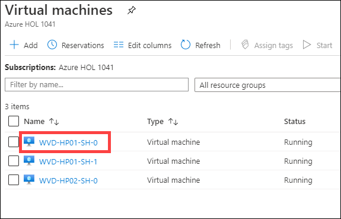

# Exercise 11: Setup FsLogix

The Windows Virtual Desktop service recommends FSLogix profile containers as a user profile solution. FSLogix is designed to roam profiles in remote computing environments, such as Windows Virtual Desktop. It stores a complete user profile in a single container. At sign in, this container is dynamically attached to the computing environment using natively supported Virtual Hard Disk (VHD) and Hyper-V Virtual Hard disk (VHDX). The user profile is immediately available and appears in the system exactly like a native user profile. This article describes how FSLogix profile containers used with Azure Files function in Windows Virtual Desktop.

## Task 1: Create Storage account and file share

1. In your Azure portal search for storage account and click on it.

   

   
   
2. Click on **+ Add**.

   

3. Use the following configuration for the storage account.

   
   
   **Subscription**: Select your default subscription
   
   **Resource group**: Select your default resource group
   
   **Storage account name**: Use any ***Unique random Name***
   
   **Location**: Default resource group location
   
   **Performance**: Standard
   
   **Account kind**: StorageV2(general purpose v2)
   
   **Replication**: Read-access-geo-redundant storage (RA-GRS)
   
   **Access tier(default)**: Hot
   
   Click on **Next: Networking**
   
   
   
4. Under networking tab use following configuration.

    
    
     **Connectivity method**: Public endpoint(selected networks)
    
     **virtual network subscription**: Default subscription
     
     **Virtual Network**: aadds-vnet
     
     **Subnets**: SessionHost(10.0.2.0/24)
     
     Leave the rest to default settings.
     
     Click on **Review + Create**.
     
     
     
5. Click on **Create**.

    
     
  

6. After deployment completes Click on notification icon on your azure portal, and click on **Go to resource**.

    
    
    
    
7. Now on left hand side under *Settings* blade click on **Configuration**.

    
    
    
8. In configuration page, scroll down and find the option **Active Directory Domain Services (Azure AD DS)**.

     
     
     **Active Directory Domain Services (Azure AD DS)**: Click on **Enabled**
     
     Click on **Save**.
     
     
     
9. Click on **Overview** to return back to storage account page.

    
    
    
    
10. Click on **File shares**.

    
    
    
    
11. Click on **+ File share**.

    
    
    
12. Enter the following name for your file share.

    
    
    **Name**: *userprofile*
    
    Click on **Create**.
    
    
    
## Task 2: Configure File share 

1. Click on the file share you just created.

   
     
     
     
2. Click on **Access Control (IAM)**, then click on **Add** and select **Add role assignment**.

  
   
   
   
3. Select following configuration for role assignment and then click on **Save**.  
   
   - Role: **Storage File Data SMB Share Contributor**
   
   - Under **Select** search for *WVDUser* and click on both the users to select them.
   
      
   

## Task 3: Configure Session Hosts

A. In this task we will install and configure FsLogix in the *WVD-HP01-SH-0* session host.

1. In your Azure portal search for *virtual machines* and click on it.

   
   
   
   
2. Click on **WVD-HP01-SH-0**.

   
   
   
   
3. On left side under Operations tab click on **Run command**.

   
   
   
   
4. Now click on **RunPowerShellScript**.

   
   
   
5. A similar window will open.

   
   
   
   
6. **Copy** the complete Script below and **paste** it by pressing **Ctrl + V** in the powershell window in the Azure portal.

 

   
       #Variables
       $storageAccountName = "NameofStorageAccount" 

       #Create Directories
       $LabFilesDirectory = "C:\LabFiles"
       New-Item -Path $LabFilesDirectory -ItemType Directory |Out-Null
       New-Item -Path "$LabFilesDirectory\FSLogix" -ItemType Directory |Out-Null

       #Download FSLogix Installation bundle
       Invoke-WebRequest -Uri "https://akipersistantstg.blob.core.windows.net/fslogix/FSLogix_Apps_Installation.zip" -OutFile "$LabFilesDirectory\FSLogix_Apps_Installation.zip"

       #Extract the downloaded FSLogix bundle
       function Expand-ZIPFile($file, $destination){
       $shell = new-object -com shell.application
       $zip = $shell.NameSpace($file)
       foreach($item in $zip.items()){
        $shell.Namespace($destination).copyhere($item)
       }
       }
      
       Expand-ZIPFile -File "$LabFilesDirectory\FSLogix_Apps_Installation.zip" -Destination "$LabFilesDirectory\FSLogix"

       #Install FSLogix
       $pathvargs = {C:\LabFiles\FSLogix\x64\Release\FSLogixAppsSetup.exe /quiet /install }
       Invoke-Command -ScriptBlock $pathvargs

       #Create registry key 'Profiles' under 'HKLM:\SOFTWARE\FSLogix'
       $registryPath = "HKLM:\SOFTWARE\FSLogix\Profiles"
       if(!(Test-path $registryPath)){
       New-Item -Path $registryPath -Force | Out-Null
       }

       #Add registry values to enable FSLogix profiles, add VHD Locations, Delete local profile and FlipFlop Directory name
       New-ItemProperty -Path $registryPath -Name "VHDLocations" -Value "\\$storageAccountName.file.core.windows.net\userprofile" -PropertyType String -Force | Out-Null
       New-ItemProperty -Path $registryPath -Name "Enabled" -Value 1 -PropertyType DWord -Force | Out-Null
       New-ItemProperty -Path $registryPath -Name "DeleteLocalProfileWhenVHDShouldApply" -Value 1 -PropertyType DWord -Force | Out-Null
       New-ItemProperty -Path $registryPath -Name "FlipFlopProfileDirectoryName" -Value 1 -PropertyType DWord -Force | Out-Null

       #Display script completion in console
       Write-Host "Script Executed successfully"
    
    
> The above script will create a new directory i.e. *C:\LabFiles* where it will download FSLogix Installation bundle and extract it. After extraction installation of FSLogix will begin. When configuring Profile Container registry settings are added here: Registry Key: *HKLM\SOFTWARE\FSLogix\Profiles*. When configuring Profile Container the entire contents of the registry will be redirected to the FSLogix Profile Container. 

8. Now scroll up on the script you pasted and replace ***NameofStorageAccount*** in second line of script with the storage account name you created in *Task 1, step 9*.

   
   
   Now Click on **Run** to execute the script.
   
   Wait for sometime for the script to execute, It will show a output saying ***Script Executed successfully***.
   
 
   
9. Now search for *Windows Virtual Desktop* in azure portal and click on it.

   
   
   
10. Click on **Users*.

    

11. In the search bar search for *WVDUser* then click on **WVDUser-01**.

    
    
    
12. Switch to sessions blade.

    
    
13. Select both WVDUser-01 and WVDUser-02 and click on **Log off**.

    
   
    > This will logoff both the session host so that when the users sign in again to the session host the Fxlogix will start functioning.
    
    
14. In you local machine, click on **Start** and search for *Remote Desktop* and open it.

    
    
    
15. Click on the **WVD-HP-01-DAG** Desktop to launch it.

    
    
16. Enter your **Credentials** to access the desktop.

    
    
    
17. Now you can see the desktop saying ***Please wait for the FSLogix Apps Services***.

    
    
    
18. Now return back to the Azure Portal and search for *storage account* and click on it.

    
    
    
19. Click on the storage account you created in **Task 1, step 3**.

    
    
    
20. Click on **File Shares**.

    
    
    
21. Click on **userprofile**.

    

22. Now you will be able to see the user profiles data stored in the fileshares.

    
