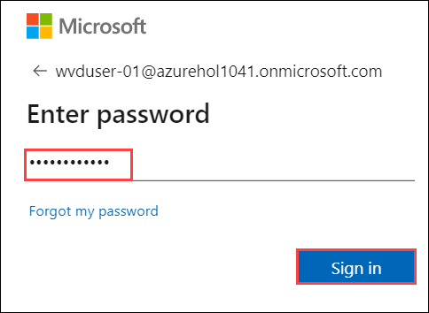

# Exercise 11: Setup FsLogix

The Windows Virtual Desktop service recommends FSLogix profile containers as a user profile solution. FSLogix is designed to roam profiles in remote computing environments, such as Windows Virtual Desktop. It stores a complete user profile in a single container. At sign in, this container is dynamically attached to the computing environment using natively supported Virtual Hard Disk (VHD) and Hyper-V Virtual Hard disk (VHDX). The user profile is immediately available and appears in the system exactly like a native user profile. This article describes how FSLogix profile containers used with Azure Files function in Windows Virtual Desktop.

## Task 1: Create Storage account and file share

1. In your Azure portal search for storage account and click on it.

   
   
2. Click on **+ Add**.

   

3. Use the following configuration for the storage account.
   
   - Subscription: Select your default subscription.
   
   - Resource group: Select your existing resource group that is **WVD-RG**.
   
   - Storage account name: Use any **storageaccount{unique-id}**
   
   - Location: Default resource group location
   
   - Performance: Standard
   
   - Account kind: StorageV2(general purpose v2)
   
   - Replication: Read-access-geo-redundant storage (RA-GRS)
   
   - Access tier(default): Hot
   
   - Click on **Next: Networking**
   
   
   
4. Under networking tab use following configuration.
    
     - Connectivity method: Public endpoint(selected networks)
    
     - Virtual network subscription: Default subscription
     
     - Virtual Network: aadds-vnet
     
     - Subnets: SessionHost(10.0.2.0/24)
     
     - Leave the rest to default settings.
     
     - Click on **Review + Create**.
     
  
     
5. Click on **Create**.

    

6. After deployment completes Click on notification icon on your azure portal, and click on **Go to resource**.

    
   
7. Now click on **Configuration** present under **Settings** blade. Then scroll down and find the option **Active Directory Domain Services (Azure AD DS)** and click on **Enabled**.

    
    
    
8. Click on **Save**.
     
   
 
9. Click on **Overview** to return back to storage account page, then click on **File shares**.

    
    
    
    
10. Click on **+ File share**.

    
    
    
12. Enter the following name for your file share.
    
    - Name: **userprofile**
    
    - Click on **Create**.
    
   

    
## Task 2: Configure File share 


1. Click on the file share you just created.

   
     
     
     
2. Click on **Access Control (IAM)**, then click on **Add** and select **Add role assignment**.

   
   
   
   
3. Select following configuration for role assignment and then click on **Save**.  
   
   - Role: **Storage File Data SMB Share Contributor**
   
   - Under **Select** search for **WVDUser** and click on both the users to select them.
   
      
   


## Task 3: Configure Session Hosts

A. In this task we will install and configure FsLogix in the **WVD-HP01-SH-0** session host.

1. In your Azure portal search for **Virtual** and click on **Virtual Machine**.

   
      
   
2. Click on **WVD-HP01-SH-0**.

   
      
   
3. On left side under Operations tab click on **Run command**.

   
  
4. Now select **RunPowerShellScript**.

   
   
   
5. A similar window will open.

   
   
      
6. **Copy** the complete Script below and **paste** it by pressing **Ctrl + V** in the powershell window in the Azure portal.

    ```
    #Variables
    $storageAccountName = "NameofStorageAccount" 

    #Create Directories
    $LabFilesDirectory = "C:\LabFiles"
    New-Item -Path $LabFilesDirectory -ItemType Directory |Out-Null
    New-Item -Path "$LabFilesDirectory\FSLogix" -ItemType Directory |Out-Null

    #Download FSLogix Installation bundle
    Invoke-WebRequest -Uri "https://akipersistantstg.blob.core.windows.net/fslogix/FSLogix_Apps_Installation.zip" -OutFile "$LabFilesDirectory\FSLogix_Apps_Installation.zip"

    #Extract the downloaded FSLogix bundle
    function Expand-ZIPFile($file, $destination){
    $shell = new-object -com shell.application
    $zip = $shell.NameSpace($file)
    foreach($item in $zip.items()){
     $shell.Namespace($destination).copyhere($item)
    }
    }

    Expand-ZIPFile -File "$LabFilesDirectory\FSLogix_Apps_Installation.zip" -Destination "$LabFilesDirectory\FSLogix"

    #Install FSLogix
    $pathvargs = {C:\LabFiles\FSLogix\x64\Release\FSLogixAppsSetup.exe /quiet /install }
    Invoke-Command -ScriptBlock $pathvargs

    #Create registry key 'Profiles' under 'HKLM:\SOFTWARE\FSLogix'
    $registryPath = "HKLM:\SOFTWARE\FSLogix\Profiles"
    if(!(Test-path $registryPath)){
    New-Item -Path $registryPath -Force | Out-Null
    }

    #Add registry values to enable FSLogix profiles, add VHD Locations, Delete local profile and FlipFlop Directory name
    New-ItemProperty -Path $registryPath -Name "VHDLocations" -Value "\\$storageAccountName.file.core.windows.net\userprofile" -PropertyType String -Force | Out-Null
    New-ItemProperty -Path $registryPath -Name "Enabled" -Value 1 -PropertyType DWord -Force | Out-Null
    New-ItemProperty -Path $registryPath -Name "DeleteLocalProfileWhenVHDShouldApply" -Value 1 -PropertyType DWord -Force | Out-Null
    New-ItemProperty -Path $registryPath -Name "FlipFlopProfileDirectoryName" -Value 1 -PropertyType DWord -Force | Out-Null

    #Display script completion in console
    Write-Host "Script Executed successfully"
    ```
 
 
    
> The above script will create a new directory i.e. *C:\LabFiles* where it will download FSLogix Installation bundle and extract it. After extraction installation of FSLogix will begin. When configuring Profile Container registry settings are added here: Registry Key: *HKLM\SOFTWARE\FSLogix\Profiles*. When configuring Profile Container the entire contents of the registry will be redirected to the FSLogix Profile Container. 


8. Now scroll up on the script you pasted and replace **NameofStorageAccount (for example: storageaccount204756)** in second line of script with the storage account name you created in *Task 1, step 9*.

   
   
   - Now Click on **Run** to execute the script.
   
 
9. Wait for sometime for the script to execute. It will show a output saying **Script Executed successfully**.

   
   
10. Click on **WVD-HP01-SH-1**.

    


11. Select **RunPowerShellScript**.

    
    
    
12. Press **Ctrl + V** to paste the script in the Powershell window.

13. Now scroll up on the script you pasted and replace **NameofStorageAccount (for example: storageaccount204756)** in second line of script with the storage account name you created in *Task 1, step 9*.

   
   
   - Now Click on **Run** to execute the script.
   
 
14. Wait for sometime for the script to execute. It will show a output saying **Script Executed successfully**.

   

  
15. Now search for **Windows Virtual Desktop** in azure portal and click on it.

   
   
   
16. Click on **Users**, then in the search bar search for **WVDUser** then click on **WVDUser-01**.

    
    
17. Switch to **Sessions** blade, then select both WVDUser-01 and WVDUser-02 and click on **Log off**.

    
    
18. Click on **OK** for **Log off user from VMs**.

    
   
    > This will logoff both the session host so that when the users sign in again to the session host the Fxlogix will start functioning.
    
    
19. Now paste this link ```aka.ms/wvdarmweb``` in your browser and enter your **credentials** to login. 

   - Username: Put username of **WVD User-01**  (for example: **WVDUser-01@azurehol1055.onmicrosoft.com**). Then click on **Next**.
   
      

   - Password: **Azure1234567** and click on **Sign in**.

      
  
    
    
20. Double click on the **WVD-HP-01-DAG** Desktop to launch it.

    
    
21. Enter your **Credentials** to access the desktop.

    
    
    
22. Now you can see the desktop saying ***Please wait for the FSLogix Apps Services***.

    
    
    > This means that user profile is being manaed by FSLogix.
    
23. Now return back to the Azure Portal and search for *storage account* and click on it.

    
    
    
24. Click on the storage account you created in **Task 1 step 3**, then under settings blade click on  **Firewalls and virtual networks**.

    
    
25. Under *Allow access from* select **All networks** and click on **save icon**.

    
    
    > This will enable access of your storage account on the public network.
    
    
26. Now click on **Overview** and open **Fileshare**.

    
    
    
27. Click on the **userprofile** fileshare.

    
    

25. Now you will be able to see the user profiles data stored in the fileshares in a ***.vhd*** format.

    
