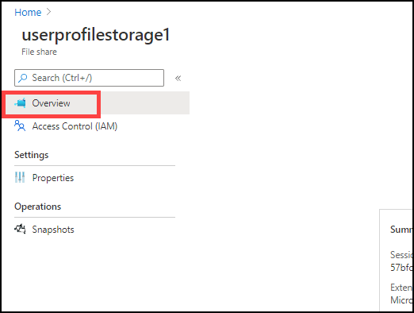

# Exercise 11: Setup FsLogix

## Task 1: Create Storage account and file share

1. In Azure portal search for *Virtual network* and click on it.

   

2. Click on **aadds-vnet-01**.

   
   
   
   
3. Under settings blade, click on **Subnets**.

   
   
   
   
4. Make sure that **both** subnets are present in aadds-vnet-01. ***(If not then follow step 5- to create a new subnet)***

   

5. Click on **+ Subnet**.

   
   
   
      
6. Configure subnet with following configuration.

   
   
   **Name**: *SessionHost-Subnet*
   
   **Address range**: *10.1.1.0/24*
   
   Leave the remaining settings to default.
   
   Click on **Ok**.
   
   
   

7. In your Azure portal search for storage account and click on it.

   

   
   
8. Click on **+ Add**.

   

9. Use the following configuration for the storae account.

   
   
   **Subscription**: Select your default subscription
   
   **Resource group**: Select your default resource group
   
   **Storage account name**: Use any ***Unique random Name***
   
   **Location**: Default resource group location
   
   **Performance**: Standard
   
   **Account kind**: StorageV2(general purpose v2)
   
   **Replication**: Locally-redundant storage(LRS)
   
   **Access tier(default)**: Hot
   
   Click on **Next: Networking**
   
   
   
10. Under networking tab use following configuration.

    
    
     **Connectivity method**: Public endpoint(selected networks)
    
     **virtual network subscription**: Default subscription
     
     **Virtual Network**: aadds-vnet-01
     
     **Subnets**: SessionHost-Subnet(10.1.1.0/24)
     
     Leave the rest to default settings.
     
     Click on **Review + Create**.
     
     
     
11. Click on **Create**.

    
     
  

12. After deployment completes Click on notification icon on your azure portal, and click on **Go to resource**.

    
    
    
    
13. Now on left hand side under *Settings* blade click on **Configuration**.

    
    
    
14. In configuration page, scroll down and find the option **Active Directory Domain Services (Azure AD DS)**.

     
     
     **Active Directory Domain Services (Azure AD DS)**: Click on **Enabled**
     
     Click on **Save**.
     
     
     
15. Click on **Overview** to return back to storage account page.

    
    
    
    
16. Click on **File shares**.

    
    
    
    
17. Click on **+ File share**.

    
    
    
18. Enter the following name for your file share.

    
    
    **Name**: *userprofilestorage1*
    
    Click on **Create**.
    
    
    
## Task 2: Configure File share 

1. Click on the file share you just created.

   
     
     
     
2. Click on **Access Control (IAM).

      
   
   
   
3. Click on **Add** under Add a role assignment.

   
   
   
   
4. Select following configuration for role assignment.

   
   
   
   **Role**: Contributer
   
   Under **Select** search for *WVDUser* and click on both the users to select them.
   
   
5. Click on **Save**.

   

## Task 3: Configure Session Hosts

1. In your Azure portal search for *virtual machines* and click on it.

   
   
   
   
2. Click on **WVD-SH-0**.

   
   
   
   
3. On left side under Operations tab click on **Run command**.

   
   
   
   
4. Now click on **RunPowerShellScript**.

   
   
   
5. A similar window will open.

   
   
   
   
6. **Copy** the complete Script below and **paste** it in the powershell window in the Azure portal.

   
       #Variables
       $storageAccountName = "<NameofStorageAccount>"

 

       #Create Directories
       $LabFilesDirectory = "C:\LabFiles"
       New-Item -Path $LabFilesDirectory -ItemType Directory |Out-Null
       New-Item -Path "$LabFilesDirectory\FSLogix" -ItemType Directory |Out-Null

 

       #Download FSLogix Installation bundle
       Invoke-WebRequest -Uri "https://akipersistantstg.blob.core.windows.net/fslogix/FSLogix_Apps_Installation.zip" -OutFile "$LabFilesDirectory\FSLogix_Apps_Installation.zip"

 

       #Extract the downloaded FSLogix bundle
       function Expand-ZIPFile($file, $destination){
       $shell = new-object -com shell.application
       $zip = $shell.NameSpace($file)
       foreach($item in $zip.items()){
        $shell.Namespace($destination).copyhere($item)
       }
       }
      
       Expand-ZIPFile -File "$LabFilesDirectory\FSLogix_Apps_Installation.zip" -Destination "$LabFilesDirectory\FSLogix"

 

       #Install FSLogix
       $pathvargs = {C:\LabFiles\FSLogix\x64\Release\FSLogixAppsSetup.exe /quiet /install }
       Invoke-Command -ScriptBlock $pathvargs

 

       #Create registry key 'Profiles' under 'HKLM:\SOFTWARE\FSLogix'
       $registryPath = "HKLM:\SOFTWARE\FSLogix\Profiles"
       if(!(Test-path $registryPath)){
       New-Item -Path $registryPath -Force | Out-Null
       }

 

       #Add registry values to enable FSLogix profiles, add VHD Locations, Delete local profile and FlipFlop Directory name
       New-ItemProperty -Path $registryPath -Name "VHDLocations" -Value "\\$storageAccountName.file.core.windows.net\userprofile" -PropertyType String -Force | Out-Null
       New-ItemProperty -Path $registryPath -Name "Enabled" -Value 1 -PropertyType DWord -Force | Out-Null
       New-ItemProperty -Path $registryPath -Name "DeleteLocalProfileWhenVHDShouldApply" -Value 1 -PropertyType DWord -Force | Out-Null
       New-ItemProperty -Path $registryPath -Name "FlipFlopProfileDirectoryName" -Value 1 -PropertyType DWord -Force | Out-Null

 

       #Display script completion in console
       Write-Host "Script Executed successfully"
    
    
    
7. Click on **Run**.

   
