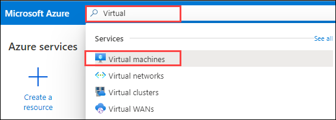
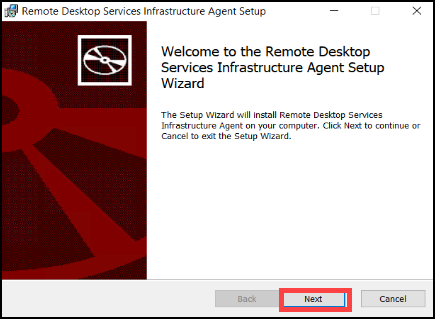

# Exercise 12: Register Azure VM as Session Host

In the following exercise, we will be creating a virtual machine which will automatically domain join by running a script in Cloud shell.
After Deployment of virtual machine we will establish a RDP connection to the virtual machine and register the virtual machine as a session host under *WVD-HP-01* hostpool.


### **Task 1: Create a Vm using Cloud Shell**

1. **Copy** the following script.

       $domain = ((Get-AzADUser | where {$_.Type -eq "Member"}).UserPrincipalName.Split('@'))[1]
       $password= ConvertTo-SecureString "Azure1234567" -AsPlainText -Force
       $adminUserName = "domainjoinadmin@$domain"
       $adminPassword = "Azure1234567"

       #Deploy Template
       $UserPasswordhash = ConvertTo-SecureString $adminPassword -AsPlainText -Force
       New-AzResourceGroupDeployment -ResourceGroupName "WVD-RG" `
       -TemplateUri "https://experienceazure.blob.core.windows.net/templates/wvd/deployVM.json" `
       -existingVNETName "aadds-vnet" -existingSubnetName "sessionhosts-subnet" -adminUsername $adminUserName -adminPassword $UserPasswordhash

       
>**Note:** The above script will be used to create a virtual machine.


2. In Azure portal click on the **Cloud Shell button** on top and wait for the cloud shell to connect.

   


3. Paste the script in the cloud shell and press **Enter** to run the script.

   
   
   >**Note:** Wait for sometime for the script to execute.
   
4. After the execution completes the output will look as following.

   

   >**Note:** Wait for few more minutes for the deployment of virtual machine to complete.


### **Task 2: Install Agents on VM and Register**

In this task we will be establish a RDP connection with the virtual machine created in previous task and download two agents:

  - Windows Virtual Desktop Agent
  - Windows Virtual Desktop Agent Bootloader
  
These two agents will be used to register this virtual machine a part of session hosts of WVD-HP-01 hostpool.

1. In search bar of your Azure portal search for virtual and select **virtual machines** from the suggestions.

   
   
2. Open **WVD-VM-01** virtual machine,then click on **Connect** and select **RDP**.

   
   
  
3. Click on **Download RDP File**.

   
   
   >**Note:** A file named **WVD-VM-01.rdp** will download.
  
4. Click on the downloaded file to open.

   
   
   
5. RDP window will open, click on **Connect**.

   
   
   
6. Click on **More choices**.

   
   
   
7. Click on **Use a different account**.

   
   
   
8. Enter your credentials.
   
     - Username: **domainjoinadmin**   
     - Password: **Azure1234567**
     - Click on **OK**.
   
   

   
9. A new pop up window will open,click on **Yes**.
 
   
    
   >**Note:** RDP Connection with your VM will be established.
    
    
10. In the Virtual Machine window click on **Accept**.
 
    
   
11. In your VM desktop double click on **Microsoft edge** icon to open it.
 
    
   
12. **Copy** and **Paste** the following URL in your VM browser and **hit enter** to download **Windows Virtual Desktop Agent**.
 
        https://query.prod.cms.rt.microsoft.com/cms/api/am/binary/RWrmXv
 
    
    
   
13. There will be a popup in the bottom of the browser asking to - **Run**, **Save** or **Cancel** the downloaded setup. Therefore choose **Run**.
 
    

14. Click on **Next** when the installer opens. 

    
        
15. Check the box saying **I accept the terms in the License Agreement** and click on **Next**.

    
    
16. Now minimise your VM RDP window and go back to Azure portal on your local machine.


17. In Azure portal search for **Host Pools** and click on it.

    
   
18. Click on **WVD-HP-01** and then click on **Registration Key**.
 
    
   
19. Copy the registration key by clicking on the **copy button** on the right corner.

    
    
    >**Note:** This unique registration key will be enable the Virtual Machine to become session host under this particular WVD-HP-01 hostpool.
    
20. Go back to the VM RDP window, and click inside the box opened in the installer.

    
      

21. On your keyboard press the following combination of keys.

    **Backspace**: To remove the current text in the box.
    
    **Ctrl + V**: To paste the key inside the box which you copied from WVD-HP-01 host pool.
    
22. Click on **Next**.

    
     
23. Click on **Install**.

    
    
24. Then click on **Finish**.

       
    
25. Open your browser and **paste** the following URL in your browser and hit **enter** to download the  **Windows Virtual Desktop Agent Bootloader**.

    ```https://query.prod.cms.rt.microsoft.com/cms/api/am/binary/RWrxrH ```      

   
 
26. There will be a popup in the bottom of the browser asking to - **Run**, **Save** or **Cancel** the downloaded setup. Therefore choose **Run**.

    
    
27. Click on **Next** when the installer opens.

    
   
28. Check the box saying **I accept the terms in the License Agreement** and click on **Next**.

    
   
29. Click on **Install**.

    
    
    
30. Then click on **Finish**.

    
    
  
  
### **Task 3: Verify registration on Host Pool**


1. In your local machine visit Azure portal and search for **Host Pools** and click on it.

   


2. Click on **WVD-HP-01**.

   
    
    
3. Under manage blade click on **Session hosts**.

   
    
    
  
4. Verify that **WVD-VM-01** is added to the **WVD-HP-01 hostpool**.

    

5. Click on the **Next** button.


