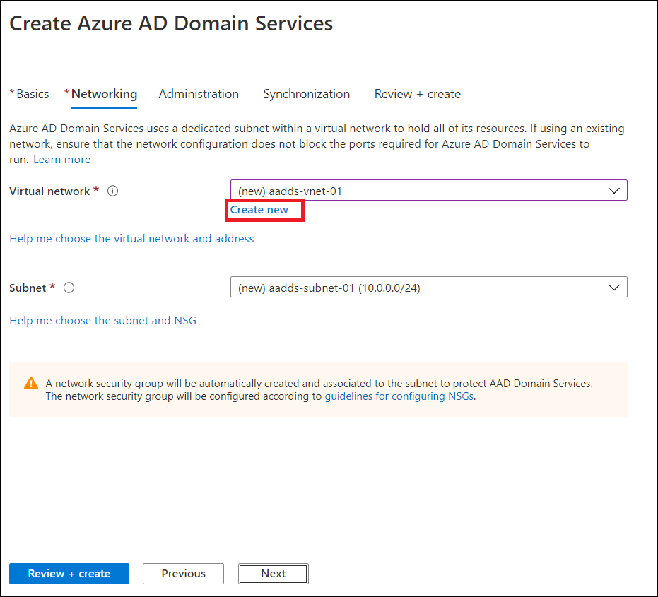
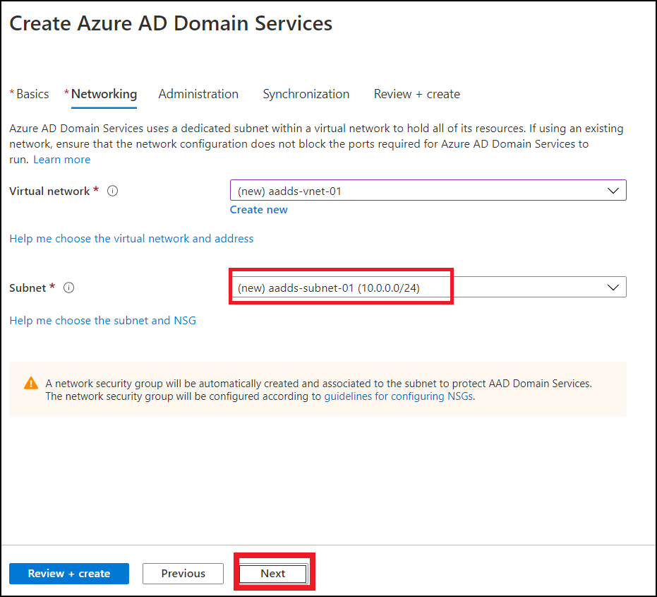

# Exercise 12: Register Azure VM as Session Host

## Task 1: Create a Vm using Cloud Shell

## Task 2: Install Agents on VM and Register

1. In search bar of your Azure portal search for *virtual machines* and click on it.

   
   
   
   
2. Click on **WVD-VM-01**.

   
   
   
   
3. Click on **Connect**.

   
   
   

4. Select **RDP**.

   
   
   
5. Click on **Download RDP File**.

   
   
   A file named ***WVD-VM-01*** will download.
   
   
   
6. Click on the downloaded file to open.

   

7. A new window will open, click on Connect.

   
   
   
   
8. Enter your Credentials.

   
   
   **Username**:
   
   **Password**:
   
   
 9. A new pop up window will open,click on **Yes**.
 
    
    
    A RDP Connection with your VM will be established.
    
    
 8. In your VM desktop double click on **Microsoft edge** icon to open it.
 
    
    
    
 9. **Copy** and **Paste** the following URL in your VM browser and **hit enter** to download *Windows Virtual Desktop Agent*.
 
        https://query.prod.cms.rt.microsoft.com/cms/api/am/binary/RWrmXv
 
    
    
    
 10. Below your browser a popup will be displayed, Click on **Run**.
 
     
