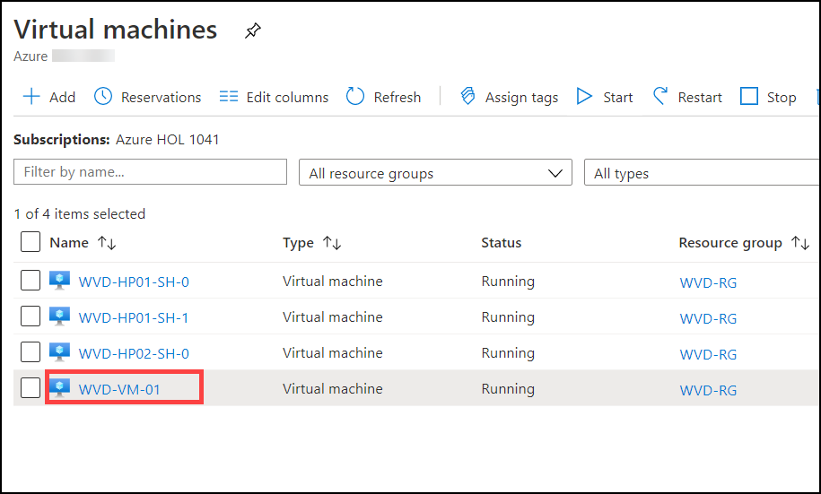
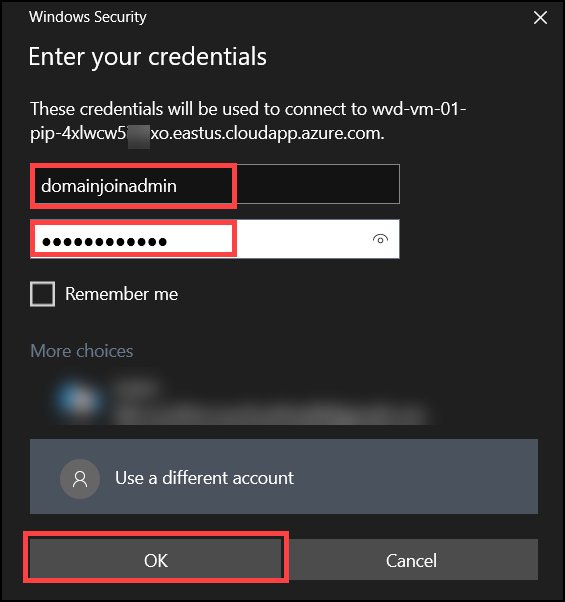

# Exercise 12: Register Azure VM as Session Host

In the following exercise, we will be creating a virtual machine which will automatically domain join by running a script in cloud shell.
After Deployment of virtual machine we will establish a RDP connection to the virtual machine and register the virtual machine as a session host under *WVD-HP-01* hostpool.

## Task 1: Create a Vm using Cloud Shell

1 **Copy** the following script.

    $domain = ((Get-AzADUser | where {$_.Type -eq "Member"}).UserPrincipalName.Split('@'))[1]
    $password= ConvertTo-SecureString "Azure1234567" -AsPlainText -Force
    $adminUserName = "domainjoinadmin@$domain"
    $adminPassword = "Azure1234567"

    #Deploy Template
    $UserPasswordhash = ConvertTo-SecureString $adminPassword -AsPlainText -Force
    New-AzResourceGroupDeployment -ResourceGroupName "WVD-RG" `
    -TemplateUri "https://akipersistantstg.blob.core.windows.net/wvdinaday/deployVM.json" `
    -existingVNETName "aadds-vnet" -existingSubnetName "sessionhosts-subnet" -adminUsername $adminUserName -adminPassword $UserPasswordhash
       
       
 > **Note:** The following script will be used to create a virtual machine.

2. In Azure portal click on the **cloud shell button** on top and wait for the cloud shell to connect.

   

3. Paste the script in the cloud shell and press **Enter** to run the script.

   
   
   wait for sometime for the script to execute.
   
   
   
4. After the execution completes the output will look as following.

    

    wait for few more minutes for the deployment of virtual machine to complete.

## Task 2: Install Agents on VM and Register

In this task we will be establish a RDP connection with the virtual machine created in previous task and download two agents:
1. Windows Virtual Desktop Agent
2. Windows Virtual Desktop Agent Bootloader
These two agents will be used to register this virtual machine a part of session hosts of WVD-HP-01 hostpool.

1. In search bar of your Azure portal search for *virtual machines* and click on it.

   
   
   
   
2. Click on **WVD-VM-01**.

   
   
   
   
3. Click on **Connect**.

   
   
   

4. Select **RDP**.

   
   
   
5. Click on **Download RDP File**.

   
   
   A file named ***WVD-VM-01*** will download.
   
   
   
6. Click on the downloaded file to open.

   
   
   
7. RDP window will open, click on **Connect**.

   
   
   
7. Click on **More choices**.

   
   
   
8. Click on **Use a different account**.

   
   
   
9. Enter your credentials.

   
   
   
   **Username**: *domainjoinadmin*
   
   **Password**: *Azure1234567*
   
   Click on **OK**.
   
   
   
10. A new pop up window will open,click on **Yes**.
 
    
    
    A RDP Connection with your VM will be established.
    
    
 11. In your Vm window click on **Accept**.
 
     
    
    
    
12. In your VM desktop double click on **Microsoft edge** icon to open it.
 
    
   
   

13. **Copy** and **Paste** the following URL in your VM browser and **hit enter** to download ***Windows Virtual Desktop Agent***.
 
        https://query.prod.cms.rt.microsoft.com/cms/api/am/binary/RWrmXv
 
    
    
    
    
14. Below your browser a popup will be displayed, Click on **Run**.
 
     

15. A installer will open, Click on **Next**.

    
    
    
    
16. Click on the **check Box** saying *I accepting the terms in the License Agreement* and click on **Next**.

    
    
    
    
17. Now minimise your VM RDP window and visit azure portal on your local machine.

18. In Azure portal search for *host pools* and click on it.

    
    
    
    
19. Click on **WVD-HP-01**.
 
    
     
     
     
20. Click on **Registration Key**.

    
    
    
    
21. Copy the registration key by clicking on the **copy button** on the right corner.

    
    
    > This unique registration key will be enable the Virtual Machine to become session host under this particular WVD-HP-01 hostpool.
    
22. Go back to the VM RDP window, and click inside the box opened in the installer.

    
     

23. On your keyboard press the following combination of keys.

    **Ctrl + A**: To select the current text in the box.
    
    **Ctrl + V**: To replace the text inside the box with the key you copied.
    
    
24. Click on **Next**.

    
     
     
     
25. Click on **Install**.

    
    
    
    
26. Click on **Finish**.

    
    
    
    
27. Open your browser and **paste** the following URL in your browser and hit **enter** to download the  ***Windows Virtual Desktop Agent Bootloader***.

        https://query.prod.cms.rt.microsoft.com/cms/api/am/binary/RWrxrH
        

    
    
    
 
 
28. A popup will open below your browser,click on **Run**

    
    
    
    
29. A installer will open, Click on **Next**.

    
    
    
    
30. Click on the **check Box** saying *I accepting the terms in the License Agreement* and click on **Next**.

    
    
    
    
31. Click on **Install*.

    
    
    
32. Click on **Finish**.

    
    
  
  
## Task 3: Verify registration on Host Pool

01. In your local machine visit Azure portal and search for *host pools* and click on it.

    

02. Click on **WVD-HP-01**.

    
    
    
03. Under manage blade click on **Session hosts**.

    
    
    
  
04. Verify that WVD-VM-01 is added to the WVD-HP-01 hostpool.

     
