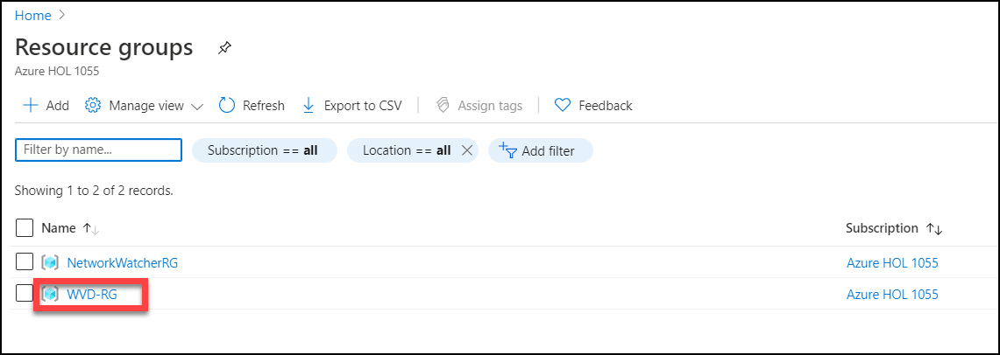
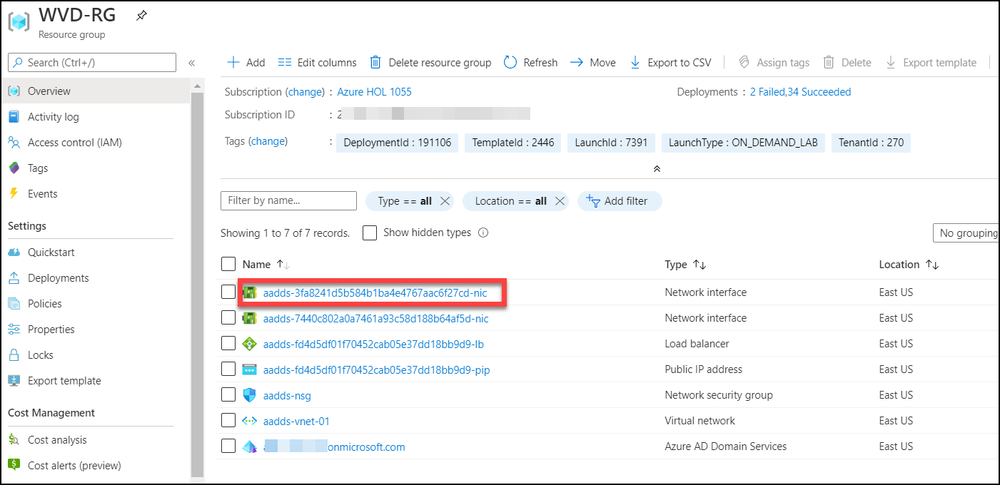
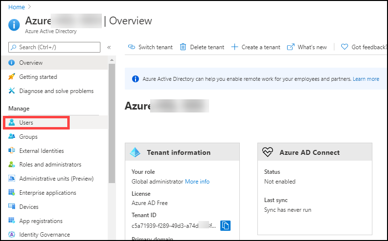
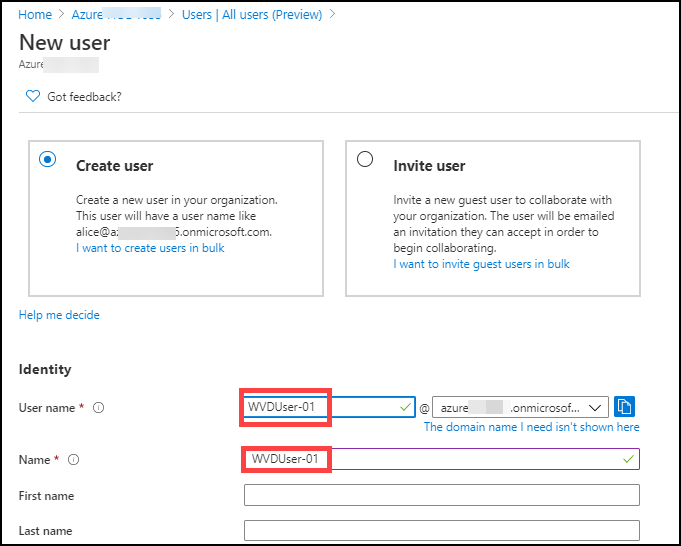
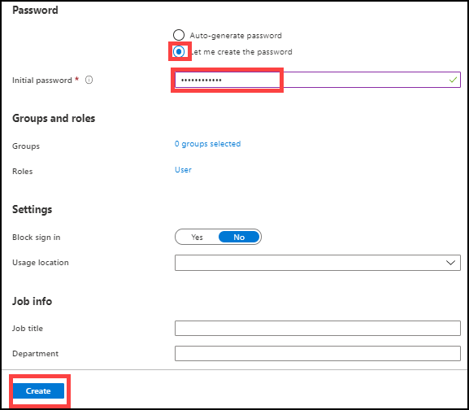

# Exercise 12: Register Azure VM as Session Host

## Task 1: Create a Vm using Cloud Shell

## Task 2: Install Agents on VM and Register

1. In search bar of your Azure portal search for *virtual machines* and click on it.

   
   
   
   
2. Click on **WVD-VM-01**.

   
   
   
   
3. Click on **Connect**.

   
   
   

4. Select **RDP**.

   
   
   
5. Click on **Download RDP File**.

   
   
   A file named ***WVD-VM-01*** will download.
   
   
   
6. Click on the downloaded file to open.

   
   
   
7. Click on **More choices**.

   
   
   
8. Click on **Use a different account**.

   
   
   
9. Enter your credentials.

   
   
   Click on **OK**.
   
   
   
10. A new pop up window will open,click on **Yes**.
 
    
    
    A RDP Connection with your VM will be established.
    
    
 11. In your Vm window click on **Accept**.
 
     
    
    
    
12. In your VM desktop double click on **Microsoft edge** icon to open it.
 
    
   
   

13. **Copy** and **Paste** the following URL in your VM browser and **hit enter** to download ***Windows Virtual Desktop Agent***.
 
        https://query.prod.cms.rt.microsoft.com/cms/api/am/binary/RWrmXv
 
    
    
    
    
14. Below your browser a popup will be displayed, Click on **Run**.
 
     

15. A installer will open, Click on **Next**.

    
    
    
    
16. Click on the **check Box** saying *I accepting the terms in the License Agreement* and click on **Next**.

    
    
    
    
17. Now minimise your VM RDP window and visit azure portal on your local machine.

18. In Azure portal search for *host pools* and click on it.

    
    
    
    
19. Click on **WVD-HP-01**.
 
    
     
     
     
20. Click on **Registration Key**.

    
    
    
    
21. Copy the registration key by clicking on the **copy button** on the right corner.

    
    
    
    
22. Go back to the VM RDP window, and click inside the box opened in the installer.

    
     

23. On your keyboard press the following combination of keys.

    **Ctrl + A**: To select the current text in the box.
    
    **Ctrl + V**: To replace the text inside the box with the key you copied.
    
    
24. Click on **Next**.

    
     
     
     
25. Click on **Install**.

    
    
    
    
26. Click on **Finish**.

    
    
    
    
27. Open your browser and **paste** the following URL in your browser and hit **enter** to download the  ***Windows Virtual Desktop Agent Bootloader***.

        https://query.prod.cms.rt.microsoft.com/cms/api/am/binary/RWrxrH
        

    
    
    
 
 
28. A popup will open below your browser,click on **Run**

    
    
    
    
29. A installer will open, Click on **Next**.

    
    
    
    
30. Click on the **check Box** saying *I accepting the terms in the License Agreement* and click on **Next**.

    
    
    
    
31. Click on **Install*.

    
    
    
32. Click on **Finish**.

    
    
  
  
## Task 3: Verify registration on Host Pool

01. In your local machine visit Azure portal and search for *host pools* and click on it.

    

02. Click on **WVD-HP-01**.

    
    
    
03. Under manage blade click on **Session hosts**.

    
    
    
  
04. Verify that WVD-VM-01 is added to the WVD-HP-01 hostpool.

     
