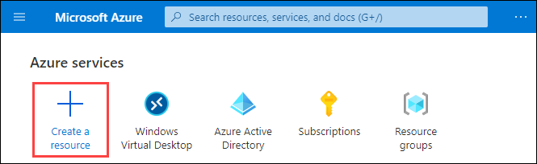

# **Summary**

## **We covered certain aspects through this 'WVD Professional' lab guide:**

- Deploying *Azure Active Directory Domain Services* (AADDS) and configuring it to be used with windows virtual desktop.

- Creating host pools of *Pooled and Personal* type and utilising it as per the needs of the user/ organisations needs.

- Deploying *session hosts* i.e. vitual machines and using them to deploy applications and windows desktop environment.

- Creating application group of type *Remote app* and *using default desktop application group*.

- Creating *workspaces* to have a isolated/ differentiated environment for the user while using windows virtual desktop. 

- *Registering application groups to the workspace* for assigning/ replacing set of applications used by the user in one go.

- Publishing applications using *start menu* and *file path* in the remote app type application groups.

- Assigning users to the application groups to allow/ restrict users fom using certain applications.

- Accessing windows virtual desktop and published applications through browser and wvd-client application.

- Setting up *FSLogix* and how FSLogix profile containers are used with Azure Files function in Windows Virtual Desktop.

- Registering a virtual machine as a session host under specific host pool to be used in a windows virtual desktop environment.

- Configuring load balancing methods i.e. *Breath first* and *Depth first* in your host pool to obtain required efficiency in your WVD environment.

## **Why Windows Virtual Desktop?**

Gartner expects that by 2023, 30% of all the on-premises VDI users will access a workspace in the cloud using DaaS!

The yearly VDI Like A Pro survey lists Windows Virtual Desktop as number one as a response to the question below. With remote working more popular than ever due to the current circumstances this is still unexpected. This yearly research is a global initiative for and by the entire EUC community and answers independently how the market looks like.

## **Windows Virtual Desktop on Azure**

For those who are looking to lift and shift their on-premises desktops, servers, and applications to the Cloud, Apps4Rent offers simple pricing for fully-managed Cloud desktops based on Azure Windows Virtual Desktop (WVD) technology. Take advantage of Windows 10 multi-session capabilities; improve performance of Office 365 applications; and have the immense scale of Azure resources at your command. 

## **Benifits**

### *Simple and easy to manage*

All the applications & operating systems layers are deeply tied together. The way users work in a Windows Virtual Desktop feels natural as the user experience is consistent throughout with the same look-and-feel of a physical desktop.

### *Multi-session Windows 10 virtual desktop experience*

Get anywhere anytime access from any device. Get the only multi-session Windows 10 desktop environment in Azure. Configure the limits to the number of users available per session as per the user/ organisation needs.

### *Office 365 Applications*

With multi-session virtual desktop options, you can use Office 365 applications. Users get the most productive virtualized environment with Windows Virtual Desktop.

### *Most compliance certifications*

Due to Microsoft's strict policies for user data protection, it invests heavily in cyber security. Azure has most compliance certifications than any other cloud service. Hence, security is guaranteed by Microsoft.
