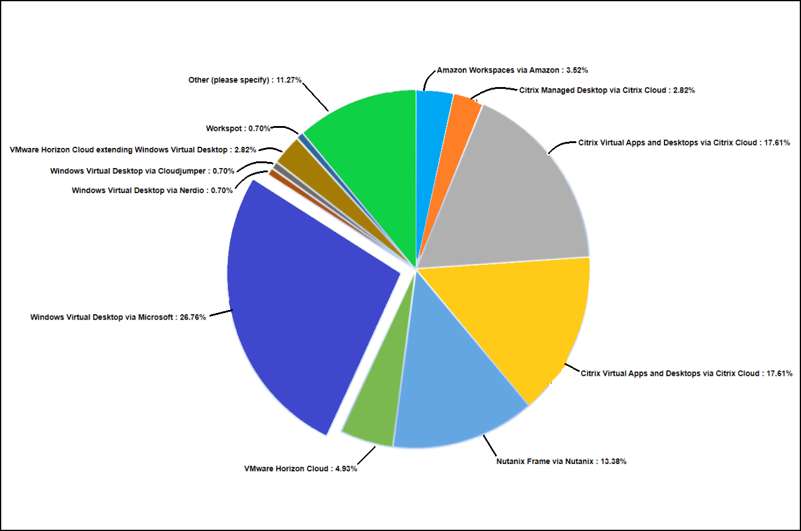

# **Summary**

## **These are the aspects we covered through this lab:**

- Deploying *Azure Active Directory Domain Services* (AADDS) and configuring it to be used with windows virtual desktop.

- Creating host pools of *Pooled and Personal* type and utilising it as per the needs of the user/ organisations needs.

- Deploying *session hosts* i.e. vitual machines and using them to deploy applications and windows desktop environment.

- Creating application group of type *Remote app* and *using default desktop application group*.

- Creating *workspaces* to have a isolated/ differentiated environment for the user while using windows virtual desktop. 

- *Registering application groups to the workspace* for assigning/ replacing set of applications used by the user in one go.

- Publishing applications using *start menu* and *file path* in the remote app type application groups.

- Assigning users to the application groups to allow/ restrict users from using certain applications.

- Accessing windows virtual desktop and published applications through browser and wvd-client application.

- Setting up *FSLogix* and how FSLogix profile containers are used with Azure Files function in Windows Virtual Desktop.

- Registering a virtual machine as a session host under specific host pool to be used in a windows virtual desktop environment.

- Configuring load balancing methods i.e. *Breath first* and *Depth first* in your host pool to obtain required efficiency in your WVD environment.

## **Why Windows Virtual Desktop?**

Accordint to Gartner by 2023, 30% of all the on-premises VDI users will be accessing workspace in the cloud using DaaS!

The yearly *VDI Like A Pro survey* lists Windows Virtual Desktop as number one as a response. Remote working is more popular than ever due to the current circumstances and further circumstances are still unexpected. This yearly research is a global initiative for and by the entire EUC community and answers independently how the market looks like.

The WVD Professional lab you just completed gives a complete walk-through on Windows Virtual Desktop, including  each and every aspect making the user confident enough to create, manage and configure Windows Virtual Desktop in a efficient and easy-to-learn manner.

The lab ensures that the user is knowledgeable enough to set up a multi-session Windows 10 deployment that delivers scalability, virtualize Microsoft 365 Apps for enterprise and optimize it to run in multi-user virtual scenarios, virtualize both desktops and apps, manage desktops and applications with a unified management experience, implement FSLogix giving seamless experience to the users and managing the user assignment distribution using different load balancing methods.

